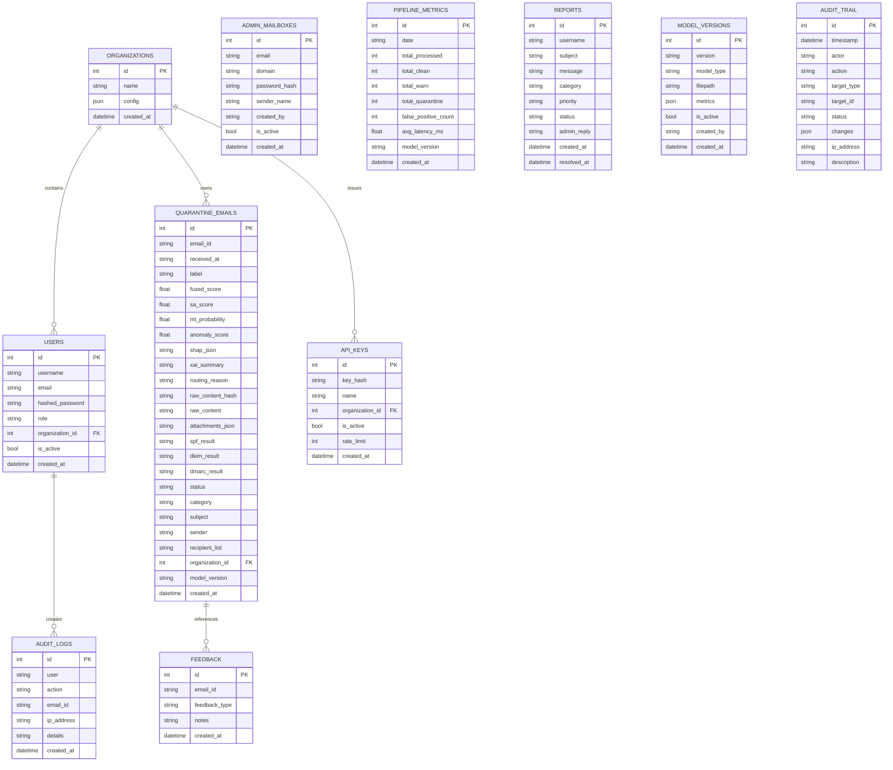
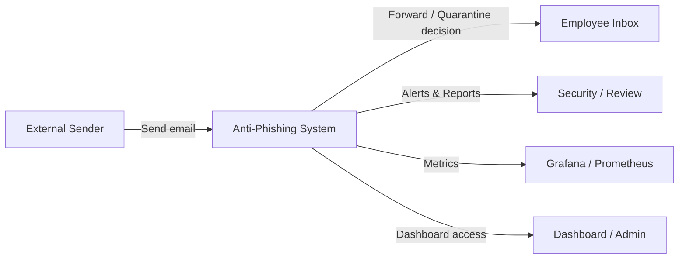
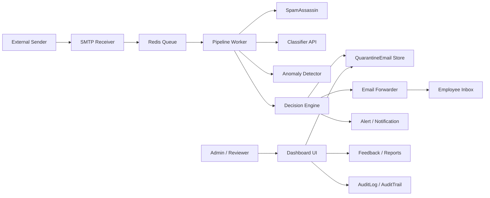
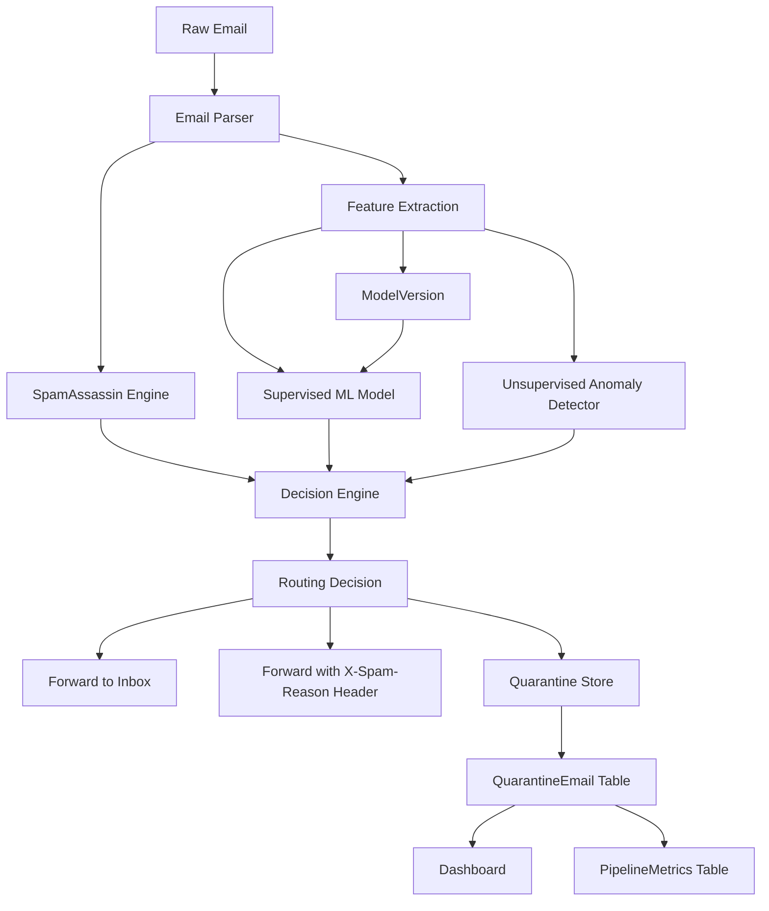
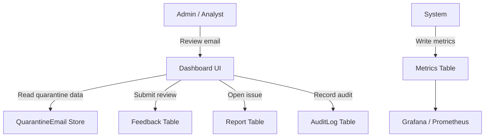

# ML-Powered Anti-Phishing and Spam Filtering

## Name of the Project
**ML-Powered Anti-Phishing and Spam Filtering**

## Database Design

### Group
- **Wisnu Alfian Nur Ashar** — ML Engineer
- **Muhammad Ilham Maulana** — Backend & Pipeline
- **Muhammad Ahda Briliantama** — Dashboard & API
- **Christofer** — Dataset & Validation
- **Risly** — Infrastructure & Monitoring

### Database Overview
Sistem menggunakan SQLAlchemy ORM untuk menyimpan status email, hasil deteksi, pengguna, audit, umpan balik, dan versi model.

#### Entitas utama
- `Organization`: tenant atau organisasi yang mengelompokkan user, email, dan API key.
- `User`: akun aplikasi dengan role `user`, `admin`, atau `superadmin`.
- `AdminMailbox`: konfigurasi mailbox admin untuk forwarding internal dan domain.
- `QuarantineEmail`: hasil pemrosesan setiap email, termasuk skor fusion dan label routing.
- `Feedback`: catatan review atau laporan terhadap email terdeteksi.
- `PipelineMetrics`: metrik pipeline harian untuk monitoring.
- `Report`: tiket/permintaan dukungan dari pengguna.
- `ApiKey`: kredensial API untuk integrasi terdaftar.
- `ModelVersion`: riwayat versi model ML dengan metadata evaluasi.
- `AuditTrail`: jejak tindakan sistem dan operator.
- `AuditLog`: log aktivitas pengguna yang dapat dilihat di dashboard.

### Entity Relationship Diagram (ERD)

### Relational Notes
- `User.organization_id` menunjuk ke `Organization.id`.
- `QuarantineEmail.organization_id` menunjuk ke `Organization.id`.
- `ApiKey.organization_id` menunjuk ke `Organization.id`.
- `QuarantineEmail.email_id` digunakan sebagai referensi untuk `Feedback.email_id`.
- `Report.username` dan `AuditLog.user` menyimpan nilai string username sebagai referensi operasional.

## Data Flow Diagram (DFD)

### DFD Level 0 (Context Diagram)

### DFD Level 1

### DFD Level 2

### DFD Level 2 - Feedback and Monitoring

## How to use this documentation
- ERD mendeskripsikan struktur tabel dan relasi utama.
- DFD Level 0/1/2 menunjukkan aliran email dari penerimaan sampai keputusan dan penyimpanan.
- DFD khusus Feedback & Monitoring menunjukkan jalur review, laporan, dan audit.
- Diagram mermaid dapat dirender langsung di GitHub atau editor Markdown yang mendukung Mermaid.

---

## Catatan tambahan
Dokumentasi ini dibuat berdasarkan struktur kode dan model SQLAlchemy yang ada pada `database/models.py`.
