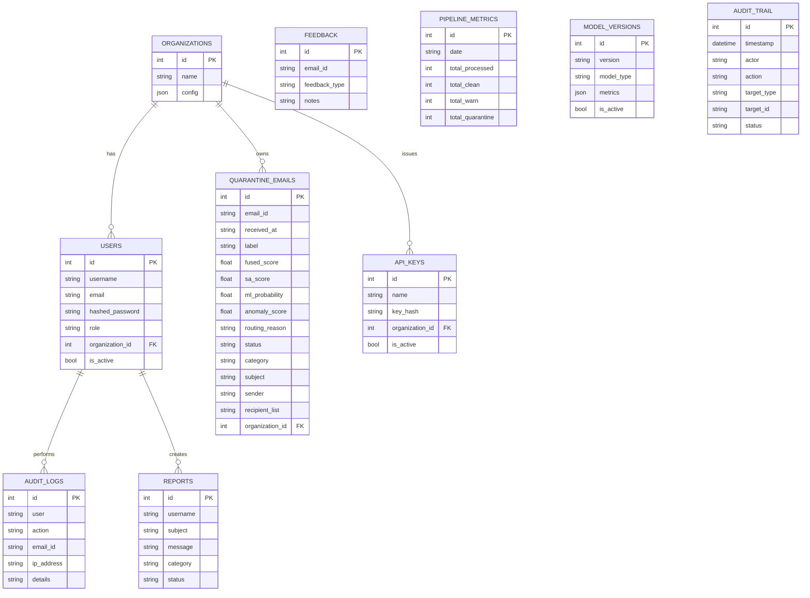
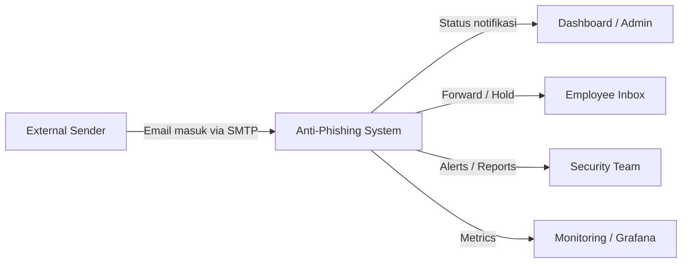
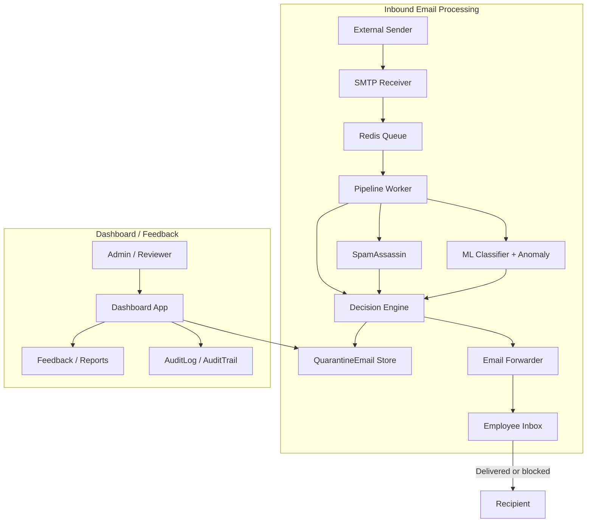
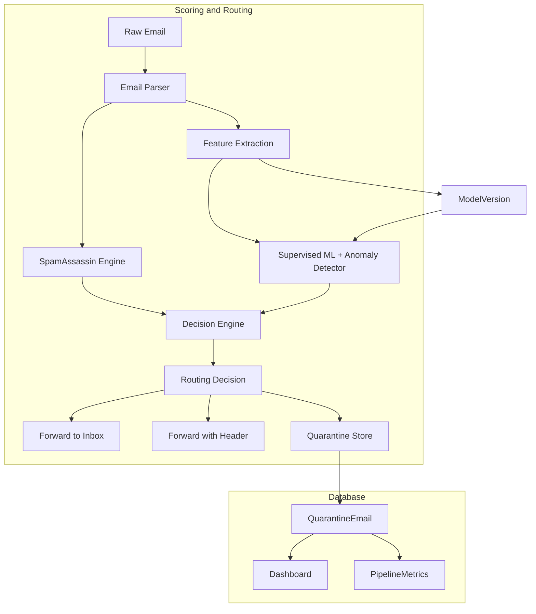
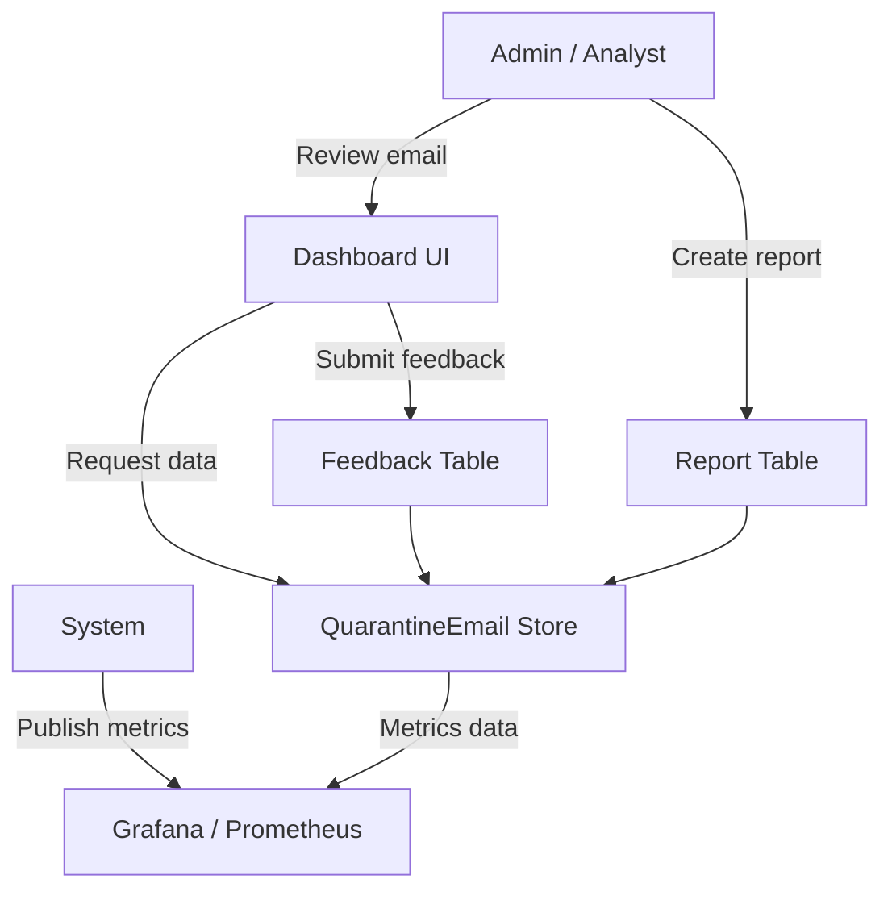

# ML-Powered Anti-Phishing and Spam Filtering

## Name of the Project
**ML-Powered Anti-Phishing and Spam Filtering**

## Database Design

### Group
- **Wisnu Alfian Nur Ashar** — ML Engineer
- **Muhammad Ilham Maulana** — Backend & Pipeline
- **Muhammad Ahda Briliantama** — Dashboard & API
- **Christofer** — Dataset & Validation
- **Risly** — Infrastructure & Monitoring

### Database Overview
Sistem menggunakan SQLAlchemy ORM dengan beberapa entitas utama yang mendukung alur email, deteksi, pengguna, audit, dan feedback.

#### Entitas utama
- `Organization`: organisasi pengguna atau tenant.
- `User`: akun aplikasi dengan peran `user`, `admin`, atau `superadmin`.
- `AdminMailbox`: kotak surat admin yang dikelola untuk forwarding dan otentikasi.
- `QuarantineEmail`: email yang diproses dan diberi label `CLEAN`, `WARN`, atau `QUARANTINE`.
- `Feedback`: catatan umpan balik terhadap email atau keputusan klasifikasi.
- `PipelineMetrics`: metrik harian pipeline untuk monitoring dan evaluasi.
- `Report`: laporan atau tiket dari pengguna.
- `ApiKey`: kunci API untuk akses terdaftar.
- `ModelVersion`: versi model yang digunakan dan metadata evaluasi.
- `AuditTrail`: jejak tindakan sistem dan operator.
- `AuditLog`: log audit yang ditampilkan di dashboard.

### Entity Relationship Diagram (ERD)

### Relational Notes
- `User.organization_id` menunjuk ke `Organization.id`.
- `QuarantineEmail.organization_id` menunjuk ke `Organization.id`.
- `ApiKey.organization_id` menunjuk ke `Organization.id`.
- `Report.username` dan `AuditLog.user` menyimpan informasi pengguna terkait operasi.
- `QuarantineEmail.email_id` digunakan sebagai referensi utama untuk `Feedback.email_id`.

## Data Flow Diagram (DFD)

### DFD Level 0 (Context Diagram)

### DFD Level 1

### DFD Level 2

### DFD untuk Fitur Feedback dan Monitoring

## Cara menggunakan dokumentasi ini
- ERD merinci struktur database dan relasi utama.
- DFD Level 0/1/2 menggambarkan aliran data dari email masuk sampai keputusan dan penyimpanan.
- Diagram mermaid dapat dirender langsung di GitHub atau di editor Markdown yang mendukung mermaid.

---

## Catatan tambahan
Dokumentasi ini dibuat berdasarkan struktur kode dan model SQLAlchemy yang ada pada file `database/models.py`.
