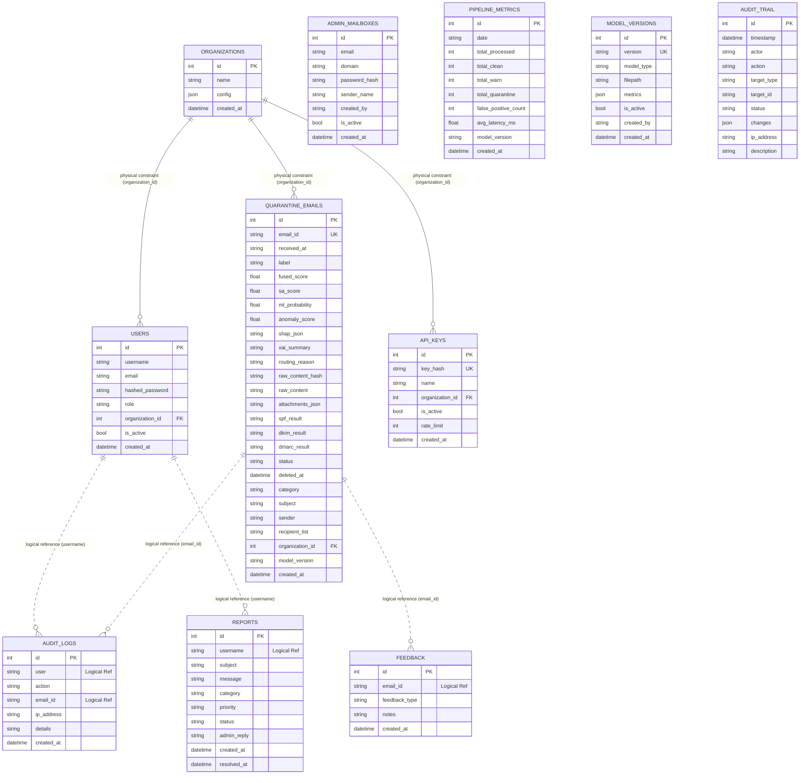
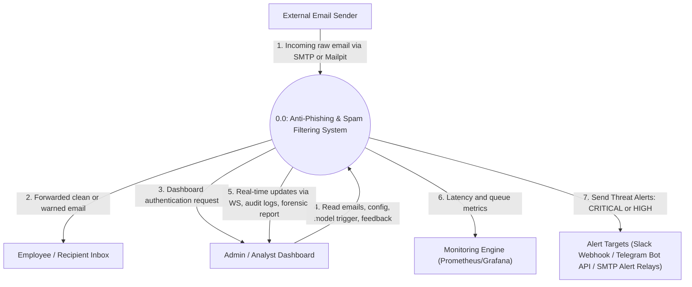
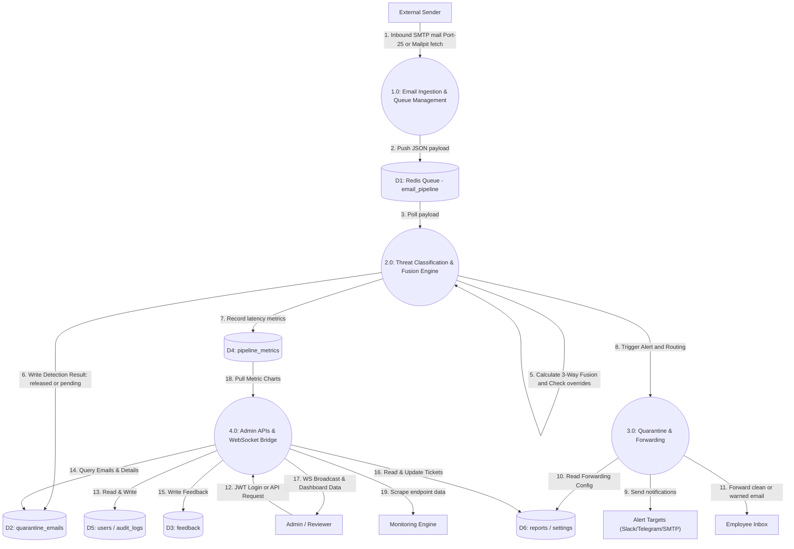
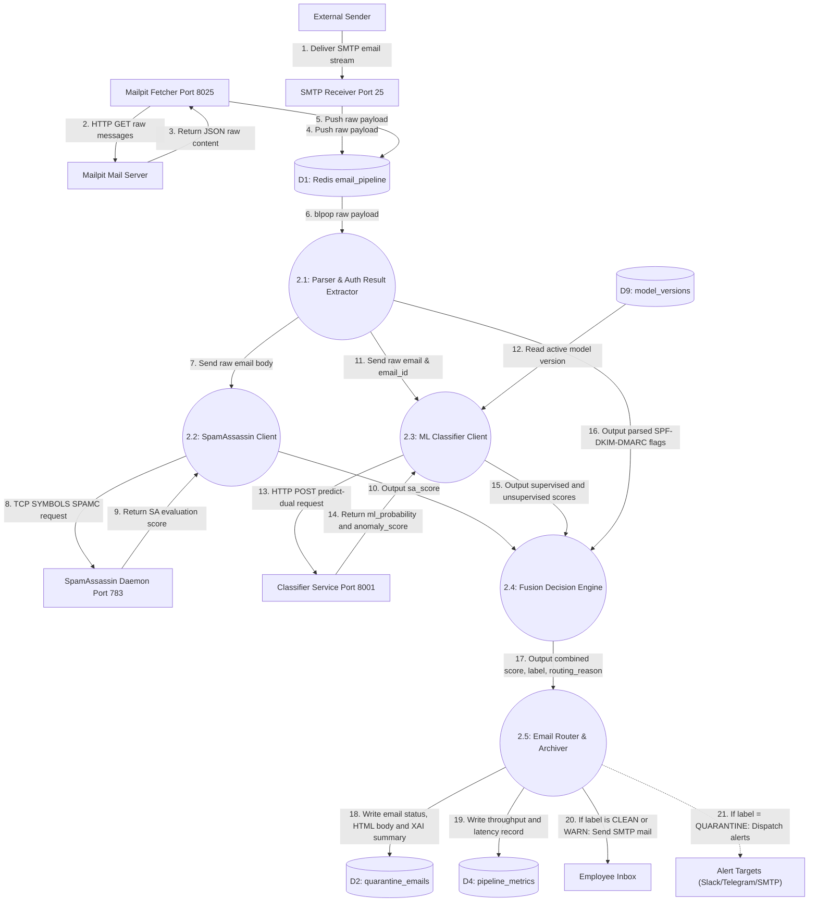
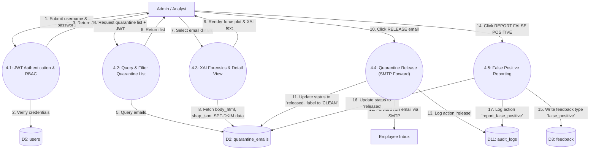
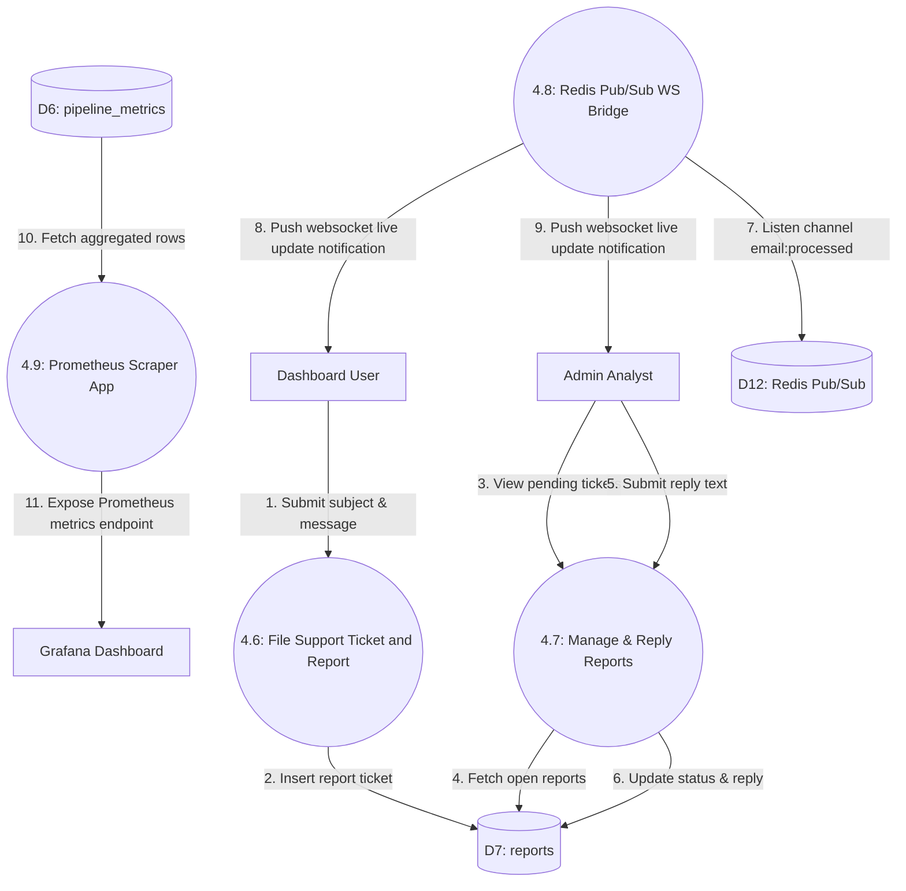

# DATABASE DESIGN AND DATA FLOW DIAGRAM (DFD) DOCUMENTATION
**CogniMail Enterprise Email Phishing and Spam Detection System**

---

## 1. Project Information
* **Project Name:** ML-Powered Anti-Phishing and Spam Filtering (CogniMail - Enterprise Edition)
* **Group Members:**
  1. **Wisnu Alfian Nur Ashar** — ML Engineer
  2. **Muhammad Ilham Maulana** — Backend & Pipeline
  3. **Muhammad Ahda Briliantama** — Dashboard & API
  4. **Christofer** — Dataset & Validation
  5. **Risly** — Infrastructure & Monitoring

---

## 2. Database Design

The system employs a relational database structure to store multi-tenant configurations, user accounts, audit trails, machine learning model registration metrics, pipeline performance metrics, support tickets, and quarantined emails. The database design is implemented via SQLAlchemy ORM models defined in [database/models.py](file:///d:/ML-Powered%20Anti-Phishing%20and%20Spam%20Filtering/lti-antiphishing/database/models.py).

### 2.1 Data Dictionary Specifications

> [!IMPORTANT]
> **Key Integrity Definitions:**
> * **Physical Foreign Key (FK):** Columns containing database-level SQL `ForeignKey` constraints are marked as **FK**.
> * **Logical Reference (Logical Ref):** Column indexes used by the application code for logical mapping without physical database constraints (optimizing SQLite/PostgreSQL write performance and data decoupling) are marked as **Logical Ref**.

#### A. `organizations` Table
Stores tenant/organization metadata in a multi-tenant environment.
| Column | Data Type | Key Type | Nullable | Description / Default |
| :--- | :--- | :--- | :--- | :--- |
| `id` | Integer | PK (Autoincrement) | No | Unique identifier for the organization |
| `name` | String(255) | Unique | No | Name of the organization |
| `config` | JSON | - | Yes | Custom configurations for the organization (Default: `{}`) |
| `created_at` | DateTime | - | No | Organization registration timestamp (Default: `utcnow`) |

#### B. `users` Table
Stores user credentials and role-based access control (RBAC) levels.
| Column | Data Type | Key Type | Nullable | Description / Default |
| :--- | :--- | :--- | :--- | :--- |
| `id` | Integer | PK (Autoincrement) | No | Unique identifier for the user |
| `username` | String(64) | Unique, Index | No | Unique login username |
| `email` | String(255) | Unique, Index | Yes | Email address of the user |
| `hashed_password` | String(128) | - | No | Password hash (bcrypt/argon2) |
| `role` | String(16) | - | No | User role: `superadmin`, `admin`, `user` (Default: `user`) |
| `organization_id` | Integer | FK (`organizations.id`) | Yes | Physical relationship to the organization (null for global superadmin) |
| `is_active` | Boolean | - | No | Flag indicating if the account is active (Default: `True`) |
| `created_at` | DateTime | - | No | Account registration timestamp (Default: `utcnow`) |

#### C. `admin_mailboxes` Table
Stores admin mailbox configuration for internal domain forwarding and synchronization.
| Column | Data Type | Key Type | Nullable | Description / Default |
| :--- | :--- | :--- | :--- | :--- |
| `id` | Integer | PK (Autoincrement) | No | Unique identifier for the mailbox |
| `email` | String(255) | Unique, Index | No | Admin mailbox email address |
| `domain` | String(255) | Index | No | Associated email domain |
| `password_hash` | String(128) | - | No | Mailbox authorization hash (Default: `""`) |
| `sender_name` | String(255) | - | No | Display name of the sender (Default: `""`) |
| `created_by` | String(64) | Index | No | Username of the creator admin |
| `is_active` | Boolean | Index | No | Flag indicating if synchronization is active (Default: `True`) |
| `created_at` | DateTime | Index | No | Record creation timestamp (Default: `utcnow`) |

#### D. `quarantine_emails` Table
Stores threat detection scores, authentication results, routing logic, and safe content.
| Column | Data Type | Key Type | Nullable | Description / Default |
| :--- | :--- | :--- | :--- | :--- |
| `id` | Integer | PK (Autoincrement) | No | Internal database row ID |
| `email_id` | String(64) | Unique, Index | No | Unique hash identifier of the email |
| `received_at` | String(32) | - | No | Timestamp when the email was received (ISO String) |
| `label` | String(16) | Index | No | Initial threat label classification (`CLEAN`, `WARN`, `QUARANTINE`) |
| `fused_score` | Float | - | No | Combined score generated by the 3-Way Decision Fusion Engine |
| `sa_score` | Float | - | No | Raw score from the SpamAssassin Daemon (Default: `0.0`) |
| `ml_probability`| Float | - | No | Spam probability from the Supervised ML Model (Default: `0.0`) |
| `anomaly_score` | Float | - | No | Anomaly score from the Unsupervised Detector (Default: `0.0`) |
| `shap_json` | Text | - | Yes | JSON representation of SHAP feature contribution values (Default: `""`) |
| `xai_summary` | Text | - | Yes | Human-readable explanation of the threat score (Default: `""`) |
| `routing_reason`| Text | - | Yes | Detailed reason explaining why this routing path was selected (Default: `""`) |
| `raw_content_hash`| String(64) | - | Yes | SHA256 hash of the raw email content (Default: `""`) |
| `raw_content` | Text | - | Yes | Cleaned email HTML body (`body_html`) up to 200,000 characters (Default: `""`) |
| `attachments_json`| Text | - | Yes | JSON array containing metadata of attachments (Default: `""`) |
| `spf_result` | String(32) | - | Yes | SPF authentication result (`PASS`, `FAIL`, etc.) (Default: `""`) |
| `dkim_result` | String(32) | - | Yes | DKIM authentication result (`SIGNED`, `FAIL`, etc.) (Default: `""`) |
| `dmarc_result` | String(32) | - | Yes | DMARC authentication result (`PASS`, `FAIL`, etc.) (Default: `""`) |
| `status` | String(16) | Index | No | Quarantine status: `pending`, `released`, `confirmed_spam`, `trash` |
| `deleted_at` | DateTime | Index | Yes | Timestamp of soft-deletion from the quarantine list |
| `category` | String(32) | Index | Yes | Extracted threat category classification (Default: `""`) |
| `subject` | String(512) | - | Yes | Subject of the email (Default: `""`) |
| `sender` | String(256) | Index | Yes | Sender email address (Default: `""`) |
| `recipient_list`| Text | - | Yes | Comma-separated list of recipient addresses (Default: `""`) |
| `organization_id`| Integer | FK (`organizations.id`) | Yes | Physical relationship to the owner organization |
| `model_version` | String(32) | Index | Yes | Version of the active ML models used (Default: `""`) |
| `created_at` | DateTime | Index | No | Database entry timestamp (Default: `utcnow`) |

#### E. `feedback` Table
Collects model feedback for future training iterations.
| Column | Data Type | Key Type | Nullable | Description / Default |
| :--- | :--- | :--- | :--- | :--- |
| `id` | Integer | PK (Autoincrement) | No | Unique identifier for feedback |
| `email_id` | String(64) | Logical Ref | No | Reference to `quarantine_emails.email_id` (Index) |
| `feedback_type` | String(32) | Index | No | Feedback label (`false_positive`, `false_negative`) |
| `notes` | Text | - | Yes | Analyst comments and review details (Default: `""`) |
| `created_at` | DateTime | Index | No | Submission timestamp (Default: `utcnow`) |

#### F. `pipeline_metrics` Table
Aggregates hourly/daily throughput and latency statistics for performance charts.
| Column | Data Type | Key Type | Nullable | Description / Default |
| :--- | :--- | :--- | :--- | :--- |
| `id` | Integer | PK (Autoincrement) | No | Unique identifier for the metric |
| `date` | String(16) | Index | No | Date of metric collection (format YYYY-MM-DD) |
| `total_processed`| Integer | - | No | Total volume of emails processed (Default: `0`) |
| `total_clean` | Integer | - | No | Total clean emails (Default: `0`) |
| `total_warn` | Integer | - | No | Total warned emails (Default: `0`) |
| `total_quarantine`| Integer | - | No | Total quarantined emails (Default: `0`) |
| `false_positive_count`| Integer | - | No | Total reported false positive feedbacks (Default: `0`) |
| `avg_latency_ms`| Float | - | No | Average pipeline latency in milliseconds (Default: `0.0`) |
| `model_version` | String(32) | Index | Yes | Active model version on this date (Default: `""`) |
| `created_at` | DateTime | Index | No | Row insertion timestamp (Default: `utcnow`) |

#### G. `reports` Table
Stores system issue reports and support tickets submitted by dashboard users.
| Column | Data Type | Key Type | Nullable | Description / Default |
| :--- | :--- | :--- | :--- | :--- |
| `id` | Integer | PK (Autoincrement) | No | Unique identifier for the ticket |
| `username` | String(64) | Logical Ref | No | Reference to `users.username` (Index) |
| `subject` | String(255) | - | No | Ticket subject title |
| `message` | Text | - | No | Explanatory message content |
| `category` | String(32) | Index | No | Ticket category classification (Default: `"other"`) |
| `priority` | String(16) | Index | No | Ticket priority: `high`, `normal`, `low` (Default: `"normal"`) |
| `status` | String(16) | Index | No | Ticket status: `open`, `in_progress`, `resolved` (Default: `"open"`) |
| `admin_reply` | Text | - | Yes | Answer/response added by the administrator |
| `created_at` | DateTime | Index | No | Ticket submission timestamp (Default: `utcnow`) |
| `resolved_at` | DateTime | - | Yes | Ticket resolution timestamp |

#### H. `api_keys` Table
Stores API credentials hashes for secure client application integrations.
| Column | Data Type | Key Type | Nullable | Description / Default |
| :--- | :--- | :--- | :--- | :--- |
| `id` | Integer | PK (Autoincrement) | No | Unique identifier for the API key |
| `key_hash` | String(128) | Unique | No | SHA256 hash of the API key |
| `name` | String(64) | - | No | Description label for the key |
| `organization_id`| Integer | FK (`organizations.id`) | Yes | Physical relationship to the owner organization |
| `is_active` | Boolean | - | No | Flag indicating if the key is active (Default: `True`) |
| `rate_limit` | Integer | - | No | Permitted requests per minute limit (Default: `100`) |
| `created_at` | DateTime | - | No | Key creation timestamp (Default: `utcnow`) |

#### I. `model_versions` Table
Tracks registered ML models, algorithm metadata, and evaluate metrics.
| Column | Data Type | Key Type | Nullable | Description / Default |
| :--- | :--- | :--- | :--- | :--- |
| `id` | Integer | PK (Autoincrement) | No | Unique identifier for the model version |
| `version` | String(32) | Unique, Index | No | Model version label (e.g., `v3.1.2`) |
| `model_type` | String(32) | Index | No | Machine Learning algorithm (e.g., `xgboost`, `isolation_forest`) |
| `filepath` | String(255) | - | Yes | Binary path of the serialized model on the server |
| `metrics` | JSON | - | Yes | Performance metrics (Accuracy, F1, Recall, dsb.) |
| `is_active` | Boolean | Index | No | Flag indicating if this model is active for inference (Default: `False`) |
| `created_by` | String(64) | - | Yes | ML Engineer who registered/trained the model |
| `created_at` | DateTime | Index | No | Registration timestamp (Default: `utcnow`) |

#### J. `audit_trail` Table
Provides structural logging of system configuration modifications.
> [!NOTE]
> This table is structurally defined in `models.py` but is **currently inactive** in the application layer. Audit records are actively logged in the `audit_logs` table.
| Column | Data Type | Key Type | Nullable | Description / Default |
| :--- | :--- | :--- | :--- | :--- |
| `id` | Integer | PK (Autoincrement) | No | Unique identifier for the audit row |
| `timestamp` | DateTime | Index | No | Time of configuration change (Default: `utcnow`) |
| `actor` | String(64) | Index | No | System agent or user executing the change |
| `action` | String(64) | Index | No | Action type name (e.g., `train`, `settings_change`) |
| `target_type` | String(64) | Index | Yes | Target object classification (e.g., `model`, `settings`) |
| `target_id` | String(128) | Index | Yes | Target unique identifier |
| `status` | String(32) | - | No | Outcome status (`SUCCESS` or `FAILURE`) |
| `changes` | JSON | - | Yes | JSON representation of modified config diffs |
| `ip_address` | String(45) | - | Yes | Originating IP address |
| `description` | Text | - | Yes | Descriptive explanation details |

#### K. `audit_logs` Table
Actively stores client/user actions captured through the dashboard API.
| Column | Data Type | Key Type | Nullable | Description / Default |
| :--- | :--- | :--- | :--- | :--- |
| `id` | Integer | PK (Autoincrement) | No | Unique identifier for the log row |
| `user` | String(64) | Logical Ref | No | Reference to `users.username` (Index) |
| `action` | String(32) | Index | No | Executed API action (e.g., `login`, `release`, `confirm_spam`) |
| `email_id` | String(64) | Logical Ref | Yes | Reference to `quarantine_emails.email_id` (Index) |
| `ip_address` | String(45) | - | Yes | Client IP address |
| `details` | Text | - | Yes | Detailed description of the action (Default: `""`) |
| `created_at` | DateTime | Index | No | Timestamp of logging (Default: `utcnow`) |

---

### 2.2 Entity Relationship Diagram (ERD)

The diagram below represents the system entities. Solid lines denote **physical database relationships (Foreign Keys)**, while dashed lines denote **logical application-level mappings (Logical References)**.

---

## 3. Data Flow Diagram (DFD)

### 3.1 DFD Level 0 (Context Diagram)

The Context Diagram defines the boundary of CogniMail, showing how external entities feed data to the system and receive outputs.

---

### 3.2 DFD Level 1 (General Flow Diagram)

Level 1 breaks the system down into its four primary functional processing zones and matches them against data stores.

---

### 3.3 DFD Level 2 (Detailed Feature Flows)

    #### Activity A: Email Processing, Detection & Fusion Pipeline (Processes 1.0, 2.0, & 3.0)
    Shows the complete ingestion flow, SMTP capture, parsing, SpamAssassin TCP scoring, Classifier REST ML probability generation, and Decision Engine evaluation.

#### Activity B: Quarantine Review & Action (Process 4.0 - Admin Management)
Details user/analyst authentication, quarantine table retrieval, XAI forensic view, and actions (releasing with status `"released"`, flagging as `"confirmed_spam"`, or writing a FP feedback entry).

#### Activity C: Feedback, Support Tickets, and WebSocket Live Metrics (Process 4.0 - Feedback Loop)
Flow mapping for report tickets submission/resolution, live processed pipeline metrics broadcasting over WebSocket, and Prometheus performance scraping.

---

## 4. Draw.io Import Instructions

To import any diagram from this document into Draw.io for presentation screenshots or editing:

1. Open [Draw.io](https://app.diagrams.net/) in your web browser.
2. Open a blank diagram page.
3. In the top toolbar, go to **Arrange** -> **Insert** -> **Advanced** -> **Mermaid...**
4. Copy the raw Mermaid block code for the diagram you want (e.g., the ERD in section 2.2 or DFD in section 3.3).
5. Paste the code into the text area in the modal dialog.
6. Click **Insert**. Draw.io will automatically compile the text into editable flowchart shapes.
7. Customize elements or export the diagram as a `.png` or `.pdf` for screenshots.
