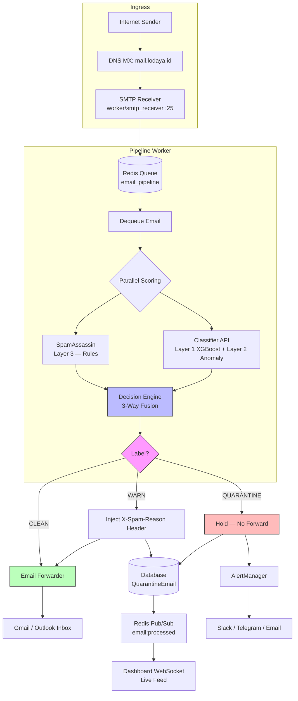
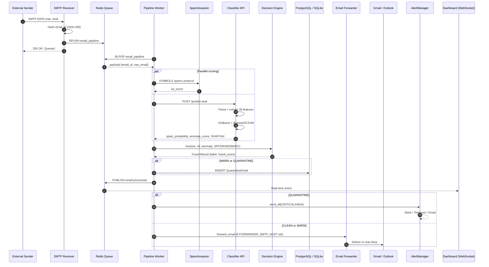
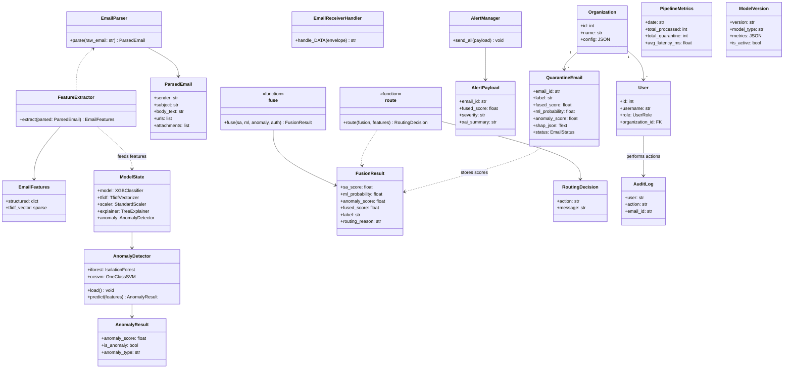

# LTI Anti-Phishing & Spam Filtering

[](LICENSE)
[](https://github.com/wi5nuu/ML-Powered-Anti-Phishing-and-Spam-Filtering/actions)

Dual-layer ML-powered anti-phishing and spam filtering for **Lodaya Technologies Indonesia (LTI)**, a FinTech company. System sits in-line between the internet and employee inboxes via MX record — every email is scanned before delivery.

**Team President University:**
- **Wisnu Alfian Nur Ashar** — ML Engineer (features, training, XGBoost, XAI)
- **Muhammad Ilham Maulana** — Backend & Pipeline (worker, SMTP receiver, forwarder, Redis)
- **Muhammad Ahda Briliantama** — Dashboard & API (FastAPI, auth, RBAC, WebSocket)
- **Christofer** — Dataset & Validation (Enron converter, synthetic generators, testing)
- **Risly** — Infrastructure & Monitoring (Docker, Prometheus, Grafana, deployment)

**Supervisor:** Fandi Gunawan, S.T., M.T.I., CISSP, CC, ISO 27001 LI, ISO 42001 LA

---

## How It Works — Production MX Record Architecture

```
                        INTERNET
                           |
                  DNS MX: mail.lodaya.id
                           |
              ┌───────────▼───────────┐
              │   SMTP Receiver       │  port 25
              │  (worker/smtp_receiver)│  receives ALL @lodaya.id emails
              └───────────┬───────────┘
                          │ push to Redis
              ┌───────────▼───────────┐
              │   Pipeline Worker     │  consumer, 3 parallel scorers
              │                       │
              │  ┌─────────────────┐  │  Layer 1: XGBoost (supervised)
              │  │  Classifier API │  │  28 features + 50k TF-IDF vocab
              │  │  :8006          │  │  Trained on 105k emails
              │  └─────────────────┘  │
              │  ┌─────────────────┐  │  Layer 2: Isolation Forest + OCSVM
              │  │  Anomaly Detector│ │  (unsupervised, zero-day detection)
              │  └─────────────────┘  │
              │  ┌─────────────────┐  │  Layer 3: SpamAssassin (rule-based)
              │  │  SpamAssassin   │  │  1000+ rules, port 783
              │  └─────────────────┘  │
              └───────────┬───────────┘
                          │ Decision Engine (3-way fusion)
               ┌──────────┼──────────┐
               ▼          ▼          ▼
            CLEAN       WARN     QUARANTINE
               │          │          │
               ▼          ▼          ▼
        Forward to    Forward +   Tahan di
        Gmail/Outlook X-Header   Dashboard
        (real inbox)  (real inbox) + Alert
```

**Key principle:** Email arrives at our SMTP server FIRST, before reaching any employee inbox. If classified as QUARANTINE, the real inbox **never receives it**.

---

## Architecture Diagrams

### Workflow Diagram

End-to-end email processing from internet ingress through scoring, fusion, routing, and delivery.



### Sequence Diagram

Component interactions for a single inbound email through the production pipeline.



### Class Diagram

Core domain models, ML pipeline classes, and decision-engine types.



---

## Detection Layers

### Layer 1 — Supervised (XGBoost + TF-IDF)

| Item | Detail |
|---|---|
| Model | XGBoost (n_estimators=300, max_depth=6, lr=0.05) |
| Training data | 1,906 training emails / 337 test emails |
| Features | 20 structured + TF-IDF (vocab: 46,577 terms) |
| **ROC-AUC (CV)** | **0.9891** |
| **ROC-AUC (Test)** | **0.9938** |
| **Avg Precision** | **0.9936** |
| **False Positive Rate** | **4.76%** |
| **False Negative Rate** | **4.73%** |
| Accuracy | **95.25%** (337 test samples) |

**Structured features (28):**

| Category | Features |
|---|---|
| URL Analysis | `num_urls`, `num_unique_domains`, `has_url_shortener`, `has_lookalike_domain`, `min_levenshtein_to_protected`, `entropy_of_links` |
| Attachment | `num_attachments`, `has_executable_attachment` |
| HTML | `html_text_ratio`, `num_images`, `num_forms`, `javascript_present` |
| Auth | `spf_pass`, `dkim_pass`, `dmarc_pass` |
| Sender | `display_name_mismatch`, `subject_has_re_fwd_fake`, `num_recipients`, `is_bulk_sender` |
| Urgency | `urgency_score`, `urgency_level` |
| Business Context | `safe_business_score`, `bec_score`, `sender_reputation`, `has_generic_greeting`, `request_for_transfer`, `ceo_impersonation`, `business_context_weight` |

### Layer 2 — Unsupervised (Isolation Forest + One-Class SVM)

| Item | Detail |
|---|---|
| Training data | 49,048 clean emails only (zero spam) |
| Features | 20 structured (subset without business context) |
| Strategy | Flags deviations from normal email patterns |
| Detection | Zero-day phishing, novel social engineering, never-before-seen attacks |
| Fusion | IForest × 0.6 + OCSVM × 0.4 |

### Layer 3 — Rule-based (SpamAssassin)

Industry-standard engine with 1000+ rules. Scores normalized to [0, 1] for fusion.

### Decision Engine (3-Way Fusion)

```
fused_score = ml_probability × 0.50 + sa_normalized × 0.25 + anomaly_score × 0.25
```

**Hard overrides:**
- SA ≥ 15.0 or ML ≥ 0.95 or Anomaly ≥ 0.90 → immediate **QUARANTINE**
- SPF + DKIM + DMARC all pass and ML < 0.50 → reduce fused by 0.10

**Routing:**

| Fused Score | Label | Action |
|---|---|---|
| < 0.30 | CLEAN | Forward to inbox |
| 0.30 – 0.70 | WARN | Forward with `X-Spam-Reason` header |
| ≥ 0.70 | QUARANTINE | Hold in database + alert |

---

## Quick Start (Development)

```bash
# Clone
git clone https://github.com/wi5nuu/ML-Powered-Anti-Phishing-and-Spam-Filtering.git
cd lti-antiphishing

# Dependencies
pip install -r requirements.txt

# Start services
python -m uvicorn classifier.predict:app --host 0.0.0.0 --port 8006   # API
python -m uvicorn dashboard.app:app --host 0.0.0.0 --port 8082        # Dashboard
python -m worker.pipeline_worker                                      # Worker

# Queue test emails
python -c "
import redis, json; r = redis.from_url('redis://localhost:6379/0')
r.rpush('email_pipeline', json.dumps({'email_id':'test','raw_email':open('email.eml').read()}))
"

# Open dashboard
# http://localhost:8082  (login: admin / changeme)
```

## Production Deployment

```bash
# 1. Set MX record at your DNS provider:
#    MX  lodaya.id  →  mail.lodaya.id  →  your-server-ip

# 2. Deploy with Docker Compose:
docker compose -f docker-compose.yml up -d

# 3. Configure email forwarding to deliver CLEAN emails to real inboxes:
export FORWARDER_SMTP_HOST=smtp.gmail.com
export FORWARDER_SMTP_PORT=587
export FORWARDER_SMTP_USER=antiphishing@lodaya.id
export FORWARDER_SMTP_PASS=your-app-password

# 4. Run SMTP receiver (needs root for port 25):
python -m worker.smtp_receiver
```

See `docs/production-deployment.md` for full production guide.

---

## Tech Stack

| Component | Technology |
|---|---|
| ML Framework | XGBoost, scikit-learn (Isolation Forest, OCSVM) |
| Text Vectorization | TF-IDF (vocab: 46,577 terms) |
| Inference API | FastAPI (port 8001) |
| Task Queue | Redis (async, `email_pipeline` list) |
| Database | SQLite (dev) / PostgreSQL (prod) |
| SMTP Receiver | aiosmtpd (port 25) |
| Email Forwarder | aiosmtplib (TLS to Gmail/Outlook) |
| **Dashboard Backend** | **FastAPI v3.0 (port 8081)** |
| **Dashboard Frontend** | **Vite + React 18 (port 5173 dev)** |
| **UI Style** | **CSS Modules, Gmail-inspired design** |
| Auth | JWT (HS256), bcrypt, RBAC (4 roles) |
| Realtime | WebSocket + Redis Pub/Sub |
| Explainability | SHAP TreeExplainer |
| Rule Engine | Apache SpamAssassin |
| **Domain Heuristics** | **Levenshtein + Jaro-Winkler + Homograph** |
| Monitoring | Prometheus + Grafana |
| Reverse Proxy | Nginx (SSL/TLS via Certbot) |
| Containerization | Docker Compose |

---

## Project Structure

```
lti-antiphishing/
├── classifier/              # ML model training & inference
│   ├── features.py          # 28 structured features + TF-IDF
│   ├── train.py             # XGBoost training (GPU)
│   ├── predict.py           # FastAPI inference (dual-layer)
│   ├── unsupervised.py      # Isolation Forest + OCSVM
│   └── models/              # Trained artifacts (*_latest.joblib)
├── decision_engine/         # Routing decisions
│   ├── fusion.py            # 3-way fusion (ML + SA + Anomaly)
│   ├── router.py            # Label routing
│   └── xai.py               # XAI explanation builder
├── worker/                  # Async pipeline
│   ├── pipeline_worker.py   # Redis consumer, orchestrator
│   ├── smtp_receiver.py     # SMTP server (port 25)
│   ├── email_forwarder.py   # Forward to Gmail/Outlook
│   └── notifier.py          # Slack/Telegram/Email alerts
├── analysis/                # Heuristic domain analysis
│   └── domain_checker.py    # Levenshtein/Jaro-Winkler/Homograph/DNS age
├── dashboard/               # Web application
│   ├── app.py               # FastAPI backend (port 8081, 18 endpoints)
│   ├── auth.py              # JWT + RBAC (4 roles)
│   ├── database.py          # DB session
│   └── frontend/            # Vite + React 18 SPA
│       └── src/
│           ├── pages/       # InboxPage, AnalyzerPage, SettingsPage, AuditPage
│           ├── components/  # GmailShell, EmailList, CategoryTabs, StatsRibbon
│           └── api/         # React Query hooks (auth, emails, metrics, analyzer)
├── database/                # Data layer
│   └── models.py            # 9 SQLAlchemy tables (incl. model_versions, audit_trail)
├── scripts/                 # 30+ utility scripts
│   ├── add_casual_ham.py
│   ├── convert_enron_to_eml.py
│   ├── generate_extended.py
│   └── ...
├── docs/                    # Documentation
│   ├── user_manual.md       # ★ Full user guide (11 sections)
│   ├── API_REFERENCE.md     # ★ All 18 endpoints with examples
│   ├── ML_MODEL_REPORT.md   # ★ Model metrics & SHAP analysis
│   ├── DEPLOYMENT_GUIDE.md  # ★ Production deployment guide
│   ├── system-documentation.md
│   └── evidence/            # Evaluation plots, confusion matrix, HTML report
├── monitoring/              # Prometheus + Grafana + alerts
├── tests/                   # Unit tests + fixtures
│   ├── fixtures/            # ★ sample_spam.eml, sample_phishing.eml, etc.
│   └── test_domain_checker.py  # ★ DomainChecker unit tests
└── docker/                  # Dockerfiles
```

---

## API Endpoints

### Classifier API (:8006)

| Method | Path | Description |
|---|---|---|
| POST | `/predict` | Supervised XGBoost + SHAP |
| POST | `/predict-unsupervised` | Unsupervised anomaly detection |
| POST | `/predict-dual` | **Both layers (primary endpoint)** |
| GET | `/health` | Model load status |
| GET | `/model-info` | Model metadata |

### Dashboard API (:8082)

| Method | Path | Description |
|---|---|---|
| GET | `/` | Quarantine table |
| GET | `/email/{id}` | Email detail + SHAP + XAI |
| GET | `/metrics-panel` | Stats, trends, top senders |
| GET | `/help` | Developer documentation |
| GET | `/api/stats` | Aggregate statistics |
| GET | `/api/health` | Dashboard health |
| WS | `/ws` | WebSocket live feed |

---

## Dataset

| Source | Count | Description |
|---|---|---|
| Enron | 11,029 | Real corporate emails |
| Dataset 1 | 15,000 | Synthetic emails (original) |
| Extended (BEC, spam, phishing, malware) | 73,942 | Targeted BEC + spam campaigns |
| Casual ham | 5,000 | Conversational ID/EN emails |
| **Total** | **105,000** | **Merged training dataset** |

Training split: 49,048 ham / 55,952 spam. Model trained on GPU with full dataset in 45 seconds.

---

## Monitoring

- **Prometheus** (:9090) — Metrics collection
- **Grafana** (:3000) — Pre-built dashboards for throughput, latency, false positives
- **Alert rules** — Critical: anomaly > 0.9, High: QUARANTINE rate spike, Warning: model drift
- **Health endpoint** — `GET /api/health` on both API and Dashboard

---

## License

MIT License — see [LICENSE](LICENSE).

---

*President University — Faculty of Computer Science — June 2026*
