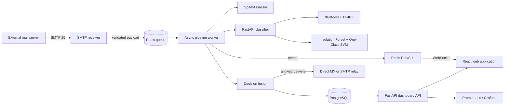
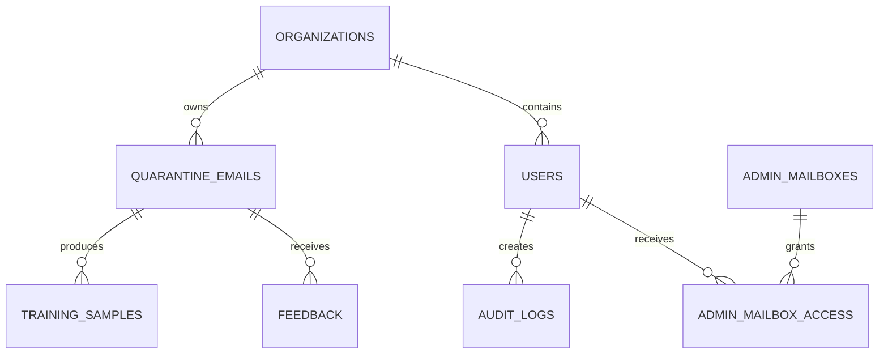

<div align="center">
  
  <h1>CogniMail</h1>
  <p><strong>ML-Powered Anti-Phishing &amp; Spam Filtering</strong></p>
  <p>Sistem keamanan email mandiri dengan webmail, deteksi berlapis, karantina terisolasi, dan pelaporan berbasis peran.</p>
  <p>
    
    
    
    
    
    
    
  </p>
</div>

---

## Tentang proyek

CogniMail menerima, menganalisis, mengelompokkan, dan membantu pengguna meninjau email menggunakan SpamAssassin, supervised machine learning, anomaly detection, serta decision fusion. Aplikasi menyediakan webmail, karantina yang terisolasi per mailbox, dashboard admin dan superadmin, audit log, laporan keamanan, dan monitoring operasional.

> [!IMPORTANT]
> Repository menyediakan aplikasi dan artefak model untuk inference. Pipeline training yang reproducible, checksum dataset, dan metrik evaluasi hold-out belum tersedia. Oleh karena itu, dokumentasi ini tidak menyatakan angka akurasi, precision, recall, F1-score, atau asal dataset training yang belum dapat dibuktikan.

## Status dan transparansi

| Status | Ruang lingkup | Makna |
| --- | --- | --- |
| ✅ Tersedia di repository | SMTP receiver, queue dan worker, deteksi berlapis, decision fusion, webmail, RBAC, isolasi mailbox, dashboard, audit, laporan, dan monitoring | Implementasi dapat diperiksa pada source code dan diuji di lingkungan yang dikonfigurasi dengan benar. |
| ⚙️ Bergantung konfigurasi | Pengiriman dan penerimaan email nyata, DNS MX/SPF/DKIM/DMARC, TLS, SMTP relay/direct-to-MX, serta integrasi VPS | Keberhasilannya bergantung pada environment, DNS, firewall, kredensial, reputasi IP, dan layanan eksternal. |
| ⚠️ Belum terbukti dari repository | Provenance dataset training, proses training yang reproducible, dan metrik performa model pada hold-out set | Jangan digunakan sebagai klaim akademik atau produksi sampai artefak buktinya ditambahkan dan divalidasi. |

Label tersebut membedakan fitur yang memang diimplementasikan dari kemampuan yang masih bergantung pada deployment. Keberadaan source code bukan jaminan bahwa suatu instance publik selalu aktif atau seluruh email akan diklasifikasikan tanpa kesalahan.

## Daftar isi

- [Tentang proyek](#tentang-proyek)
- [Status dan transparansi](#status-dan-transparansi)
- [Kemampuan utama](#kemampuan-utama)
- [Peran dan batas akses](#peran-dan-batas-akses)
- [Arsitektur](#arsitektur)
- [Alur deteksi](#alur-deteksi)
- [Struktur repository](#struktur-repository)
- [Persyaratan](#persyaratan)
- [Menjalankan secara lokal](#menjalankan-secara-lokal)
- [Deployment VPS dengan Nginx](#deployment-vps-dengan-nginx)
- [Deployment alternatif dengan Caddy](#deployment-alternatif-dengan-caddy)
- [Konfigurasi email dan DNS](#konfigurasi-email-dan-dns)
- [Environment variables](#environment-variables)
- [Operasi dan monitoring](#operasi-dan-monitoring)
- [Pengujian](#pengujian)
- [API dan data](#api-dan-data)
- [Keamanan](#keamanan)
- [Troubleshooting](#troubleshooting)
- [Batasan dan bukti requirement 5.4](#batasan-dan-bukti-requirement-54)
- [Tim proyek](#tim-proyek)
- [Lisensi](#lisensi)

## Kemampuan utama

- SMTP receiver untuk menerima email berdasarkan mailbox aktif dan domain yang diizinkan.
- Redis queue dan worker asinkron untuk memisahkan proses penerimaan dari analisis.
- SpamAssassin melalui protokol `spamd`.
- XGBoost dengan representasi TF-IDF dan fitur terstruktur.
- Isolation Forest dan One-Class SVM untuk anomaly detection.
- Analisis URL/domain, typosquatting, homoglyph, metadata MIME, attachment, serta hasil autentikasi email yang diverifikasi receiver.
- Decision fusion berbobot dengan hard threshold dan evidence gating.
- Label operasional `CLEAN`, `WARN`, dan `QUARANTINE`.
- Penjelasan keputusan melalui alasan routing, kontribusi fitur XGBoost, dan metadata deteksi.
- Webmail dengan compose, reply, forward, draft, sent, starred, attachment, dan pencarian.
- Isolasi data berdasarkan mailbox; satu mailbox tidak dapat membaca data mailbox lain.
- Review phishing, spam, dan warning hanya untuk admin atau superadmin.
- Dashboard admin/superadmin, audit log, laporan ancaman, ekspor PDF/Excel, dan halaman kesehatan sistem.
- Prometheus, Grafana, Redis exporter, dan PostgreSQL exporter.
- Dukungan Bahasa Indonesia dan English pada frontend React.

## Peran dan batas akses

| Peran | Akses utama |
| --- | --- |
| `mailbox` / end user | Membaca email bersih miliknya, compose, reply, forward, draft, sent, starred, dan membuat laporan masalah. |
| `user` | Dashboard pengguna dan mailbox yang diberikan kepadanya. Data tetap dibatasi ke identitas mailbox yang sah. |
| `admin` | Mengelola mailbox yang ditugaskan, meninjau phishing/spam/warning, melihat log dan laporan dalam cakupannya, serta mengambil tindakan review. |
| `superadmin` | Cakupan global: organisasi, admin, mailbox, analytics, laporan ancaman, audit, training samples, dan kesehatan sistem. |

End user tidak menerima menu review `Phishing`, `Spam`, atau `Peringatan`. Backend juga menolak daftar kategori tersebut dan menyembunyikan detail pesannya, sehingga pembatasan tidak bergantung pada tampilan frontend saja.

## Arsitektur


```mermaid
flowchart LR
    Sender[External mail server] -->|SMTP 25| Receiver[SMTP receiver]
    Receiver -->|validated payload| Redis[(Redis queue)]
    Redis --> Worker[Async pipeline worker]
    Worker --> SA[SpamAssassin]
    Worker --> Classifier[FastAPI classifier]
    Classifier --> XGB[XGBoost + TF-IDF]
    Classifier --> Anomaly[Isolation Forest + One-Class SVM]
    Worker --> Fusion[Decision fusion]
    Fusion --> DB[(PostgreSQL)]
    Fusion -->|allowed delivery| Outbound[Direct MX or SMTP relay]
    DB --> Dashboard[FastAPI dashboard API]
    Dashboard --> UI[React web application]
    Worker -->|events| PubSub[Redis Pub/Sub]
    PubSub -->|WebSocket| UI
    Dashboard --> Metrics[Prometheus / Grafana]
```

Service utama pada `docker-compose.yml`:

| Service | Fungsi | Port host default |
| --- | --- | --- |
| `dashboard` | FastAPI API dan React build | `127.0.0.1:8080` |
| `classifier` | Inference supervised dan unsupervised | `127.0.0.1:8001` |
| `worker` | Konsumen queue dan pipeline deteksi | Tidak dipublikasikan |
| `smtp_receiver` | SMTP inbound | `0.0.0.0:25` production, `2525` local |
| `spamassassin` | Rule-based scoring | `127.0.0.1:783` |
| `postgres` | Penyimpanan utama | Hanya jaringan internal Compose |
| `redis` | Queue, Pub/Sub, dan heartbeat | Loopback host |
| `prometheus` | Pengumpulan metrik | `127.0.0.1:9090` |
| `grafana` | Visualisasi monitoring | `127.0.0.1:3000` |
| `mailpit` | SMTP sandbox untuk profil local | `127.0.0.1:8025` |
| `caddy` | Reverse proxy/TLS opsional | `80` dan `443`, profil production |

## Alur deteksi

1. SMTP receiver memvalidasi ukuran pesan, recipient, domain, dan mailbox aktif.
2. Raw MIME dimasukkan ke Redis queue.
3. Worker mengekstrak body, header, pengirim, recipient, URL, attachment, serta hasil autentikasi yang dipercaya.
4. SpamAssassin menghasilkan `sa_score`.
5. Classifier menghasilkan probabilitas supervised, anomaly score, dan kontribusi fitur.
6. Decision engine menormalisasi skor SpamAssassin dan menghitung:

   ```text
   fused_score = ML × 0.50 + SA_normalized × 0.25 + anomaly × 0.25
   ```

   Bobot dan threshold dapat diubah melalui environment variables.

7. Hard threshold, evidence gating, authentication evidence, dan content guard diterapkan sebelum label final disimpan.
8. Hasil, raw content, skor, alasan routing, metadata autentikasi, dan informasi attachment disimpan di PostgreSQL.
9. UI menerima pembaruan melalui Redis Pub/Sub dan WebSocket.

### Makna label

| Label | Makna operasional |
| --- | --- |
| `CLEAN` | Pesan dilepas ke inbox yang sesuai dan dapat diteruskan jika forwarding aktif. |
| `WARN` | Pesan borderline; hanya admin/superadmin yang dapat melihat kategori review di CogniMail. Warning yang memenuhi aturan delivery dapat membawa header penjelasan saat diteruskan ke tujuan forwarding. |
| `QUARANTINE` | Pesan ditahan untuk review admin/superadmin dan tidak ditampilkan kepada end user. |

Threshold default:

- clean: `fused_score < 0.30`
- warning band: `0.30 ≤ fused_score < 0.70`
- quarantine: `fused_score ≥ 0.70`

Nilai ini bukan jaminan akurasi. Evaluasi model dan tuning threshold harus dilakukan dengan dataset validasi yang representatif.

## Struktur repository

```text
CogniMail/
├── analysis/               Analisis URL dan domain
├── classifier/             Feature extraction, inference API, dan model artifacts
├── dashboard/              FastAPI dashboard, RBAC, React frontend, dan static assets
├── database/               SQLAlchemy models
├── decision_engine/        Fusion, content guard, dan XAI helpers
├── docker/                 Dockerfile untuk classifier, dashboard, dan worker
├── mail_delivery/          Direct-to-MX delivery dan DKIM signing
├── monitoring/             Prometheus, Grafana, alerts, dan Caddyfile
├── scripts/                Start/stop serta migrasi operasional
├── tests/                  Unit dan integration-style tests
├── worker/                 SMTP receiver, pipeline worker, forwarding, dan notifier
├── .env.example            Template konfigurasi tanpa secret
├── docker-compose.yml      Definisi seluruh service
├── requirements.txt        Dependency Python
└── seed_data.py            Data development opsional
```

## Persyaratan

- Docker Engine atau Docker Desktop dengan Docker Compose v2.
- Domain dan DNS yang dapat dikelola untuk SMTP production.
- VPS dengan inbound TCP `25` jika menerima email langsung dari internet.
- Outbound TCP `25` untuk mode direct-to-MX, atau kredensial SMTP relay untuk mode relay.
- Port `80/443` hanya boleh digunakan oleh satu reverse proxy.

## Menjalankan secara lokal

### 1. Siapkan environment

PowerShell:

```powershell
Copy-Item .env.example .env
python -c "import secrets; print(secrets.token_hex(32))"
```

Bash:

```bash
cp .env.example .env
python -c "import secrets; print(secrets.token_hex(32))"
```

Masukkan nilai acak tersebut ke `DASHBOARD_SECRET_KEY`, lalu ganti seluruh nilai `CHANGE_ME`. Jangan commit `.env`.

### 2. Jalankan stack local

Windows:

```powershell
Set-ExecutionPolicy -Scope Process RemoteSigned
.\scripts\start.ps1 -Profile local -Build
```

Linux/macOS:

```bash
chmod +x scripts/start.sh scripts/stop.sh
./scripts/start.sh local --build
```

Endpoint local:

- Dashboard: <http://localhost:8080>
- Classifier health: <http://localhost:8001/health>
- Mailpit: <http://localhost:8025>
- Grafana: <http://localhost:3000>
- Prometheus: <http://localhost:9090>
- SMTP testing: `localhost:2525`

Stop stack:

```powershell
.\scripts\stop.ps1 -Profile local
```

atau:

```bash
./scripts/stop.sh local
```

### Seed data development

Seed hanya untuk development/testing dan tidak diperlukan pada production:

```bash
docker compose --env-file .env --profile seed run --rm seed
```

## Deployment VPS dengan Nginx

Bagian ini sesuai untuk VPS yang sudah menjalankan Nginx pada port `80/443`. Jangan mengaktifkan profil Caddy dalam arsitektur ini.

### 1. Siapkan `.env`

Nilai minimum yang harus diperiksa:

```dotenv
ENV=production
DASHBOARD_DOMAIN=cognimail.example.com
ALLOWED_HOSTS=cognimail.example.com,localhost,127.0.0.1,dashboard
CORS_ORIGINS=https://cognimail.example.com
VITE_MAIL_DOMAIN=example.com
ACCEPTED_MAIL_DOMAINS=example.com
SMTP_DOMAIN=mail.example.com
SMTP_PUBLIC_PORT=25
OUTBOUND_SMTP_MODE=direct
OUTBOUND_HELO_HOSTNAME=mail.example.com
```

Pastikan `DB_PASSWORD` sama dengan password di URL database, dan semua secret `CHANGE_ME` sudah diganti.

### 2. Jalankan service tanpa Caddy

```bash
cd /opt/CogniMail
git pull --ff-only origin master
ENV=production SMTP_PUBLIC_PORT=25 docker compose --env-file .env up -d --build
docker compose --env-file .env ps
```

Perintah tersebut menjalankan service tanpa profil `production`, sehingga Caddy dan `node_exporter` tidak ikut aktif. Nginx host tetap menjadi reverse proxy.

### 3. Konfigurasi Nginx

Contoh server HTTPS:

```nginx
server {
    server_name cognimail.example.com;
    client_max_body_size 30m;

    location /ws {
        proxy_pass http://127.0.0.1:8080;
        proxy_http_version 1.1;
        proxy_set_header Upgrade $http_upgrade;
        proxy_set_header Connection "upgrade";
        proxy_set_header Host $host;
        proxy_set_header X-Real-IP $remote_addr;
        proxy_set_header X-Forwarded-For $proxy_add_x_forwarded_for;
        proxy_set_header X-Forwarded-Proto $scheme;
    }

    location / {
        proxy_pass http://127.0.0.1:8080;
        proxy_http_version 1.1;
        proxy_set_header Host $host;
        proxy_set_header X-Real-IP $remote_addr;
        proxy_set_header X-Forwarded-For $proxy_add_x_forwarded_for;
        proxy_set_header X-Forwarded-Proto $scheme;
    }

    listen 443 ssl;
    ssl_certificate /etc/letsencrypt/live/cognimail.example.com/fullchain.pem;
    ssl_certificate_key /etc/letsencrypt/live/cognimail.example.com/privkey.pem;
}

server {
    listen 80;
    server_name cognimail.example.com;
    return 301 https://$host$request_uri;
}
```

Validasi dan reload:

```bash
sudo nginx -t
sudo systemctl reload nginx
```

## Deployment alternatif dengan Caddy

Gunakan opsi ini hanya jika port `80/443` tidak dipakai Nginx, Apache, atau service lain:

```bash
./scripts/start.sh production --build
```

Profil `production` mengaktifkan Caddy dan `node_exporter`. Jika muncul `failed to bind host port 0.0.0.0:80`, hentikan reverse proxy lain atau gunakan deployment Nginx tanpa profil seperti pada bagian sebelumnya. Jangan menjalankan Nginx dan Caddy pada port yang sama.

## Konfigurasi email dan DNS

### DNS inbound

Contoh untuk mailbox `user@example.com` dan SMTP host `mail.example.com`:

```dns
mail.example.com.       A      203.0.113.10
example.com.            MX 10  mail.example.com.
```

Pastikan firewall VPS dan firewall provider membuka inbound TCP `25`.

### Reputasi outbound

Untuk direct-to-MX, siapkan:

- PTR/rDNS IP VPS menuju hostname pada `OUTBOUND_HELO_HOSTNAME`.
- A record hostname tersebut kembali ke IP VPS yang sama.
- SPF yang mengizinkan IP pengirim.
- DKIM selector dan public key DNS jika DKIM signing diaktifkan.
- DMARC policy untuk domain pengirim.

Uji koneksi outbound:

```bash
nc -vz gmail-smtp-in.l.google.com 25
```

### Mode direct-to-MX

```dotenv
OUTBOUND_SMTP_MODE=direct
OUTBOUND_HELO_HOSTNAME=mail.example.com
OUTBOUND_DKIM_DOMAIN=example.com
OUTBOUND_DKIM_SELECTOR=cognimail
OUTBOUND_DKIM_PRIVATE_KEY_FILE=/path/in/container/private.key
OUTBOUND_DKIM_REQUIRED=true
```

Mode direct memerlukan outbound TCP `25` dan konfigurasi reputasi yang benar.

### Mode SMTP relay

```dotenv
OUTBOUND_SMTP_MODE=relay
FORWARDER_SMTP_HOST=smtp.provider.example
FORWARDER_SMTP_PORT=587
FORWARDER_SMTP_USER=mailer@example.com
FORWARDER_SMTP_PASS=app-password
FORWARDER_FROM=
FORWARDER_STARTTLS=true
```

Relay harus mengizinkan alamat mailbox CogniMail sebagai sender. Untuk provider yang memakai implicit TLS pada port `465`, sesuaikan port dan `FORWARDER_STARTTLS` dengan dokumentasi provider.

## Environment variables

Gunakan `.env.example` sebagai template awal. Variabel penting:

| Variabel | Kegunaan |
| --- | --- |
| `ENV` | `local` atau `production`. |
| `DASHBOARD_SECRET_KEY` | Secret session/JWT; wajib acak dan rahasia. |
| `ALLOWED_HOSTS` | Host yang diterima FastAPI. |
| `CORS_ORIGINS` | Origin frontend yang diizinkan. |
| `DB_PASSWORD` | Password PostgreSQL. |
| `DB_SYNC_URL` | URL SQLAlchemy sinkron untuk dashboard/seed. |
| `WORKER_DB_URL` | URL PostgreSQL async untuk worker. |
| `REDIS_URL` | Queue, Pub/Sub, dan heartbeat Redis. |
| `VITE_MAIL_DOMAIN` | Domain alamat mailbox pada frontend. |
| `ACCEPTED_MAIL_DOMAINS` | Domain recipient yang diterima SMTP receiver. |
| `MAX_MESSAGE_BYTES` | Batas ukuran email inbound, default 25 MiB. |
| `SMTP_PUBLIC_PORT` | Port SMTP host; `25` production, `2525` local. |
| `SMTP_TLS_CERT` / `SMTP_TLS_KEY` | Sertifikat STARTTLS dalam container. |
| `OUTBOUND_SMTP_MODE` | `direct` atau `relay`. |
| `FUSION_*_WEIGHT` | Bobot ML, SpamAssassin, dan anomaly. |
| `THRESHOLD_CLEAN` / `THRESHOLD_WARN` | Batas routing decision engine. |
| `SUPERADMIN_USERNAME` / `SUPERADMIN_PASSWORD` | Akun break-glass awal. |
| `GF_SECURITY_ADMIN_*` | Kredensial Grafana. |

## Operasi dan monitoring

Status dan log:

```bash
docker compose --env-file .env ps
docker compose --env-file .env logs -f dashboard
docker compose --env-file .env logs -f smtp_receiver worker classifier spamassassin
```

Health endpoints:

```bash
curl -fsS http://127.0.0.1:8080/api/health
curl -fsS http://127.0.0.1:8001/health
curl -fsS http://127.0.0.1:8001/model-info
```

### Backup PostgreSQL

```bash
docker compose exec -T postgres sh -c \
  'pg_dump -U "$POSTGRES_USER" -d "$POSTGRES_DB" -Fc' \
  > cognimail-$(date +%F).dump
```

Restore harus diuji pada database terpisah sebelum digunakan pada production.

### Update aplikasi

```bash
git pull --ff-only origin master
ENV=production SMTP_PUBLIC_PORT=25 docker compose --env-file .env up -d --build
docker compose --env-file .env ps
```

## Pengujian

### Python

Dengan dependency lokal terpasang:

```bash
python -m unittest discover -s tests -p "test_*.py"
```

Pada Windows dengan virtual environment repository:

```powershell
.\.venv\Scripts\python.exe -m unittest discover -s tests -p "test_*.py"
```

Pengujian khusus dashboard menggunakan image yang sama dengan deployment. Image dashboard tidak memuat package worker, classifier, atau decision engine, sehingga jangan memakai perintah ini untuk full-suite discovery:

```powershell
docker compose build dashboard
docker compose run --rm --no-deps -v "${PWD}\tests:/app/tests" `
  --entrypoint python dashboard -m unittest tests.test_dashboard_user_flows
```

### Frontend

```bash
cd dashboard/frontend
npm ci
npm run build
```

### Validasi Compose

```bash
docker compose --env-file .env config --quiet
docker compose --env-file .env --profile local config --quiet
docker compose --env-file .env --profile production config --quiet
```

## API dan data

Kelompok endpoint utama:

| Prefix | Kegunaan |
| --- | --- |
| `/api/auth/*` | Login, session, profile, password, dan API key. |
| `/api/mailboxes/*` | Login/autologin dan akses mailbox. |
| `/api/emails/*` | Daftar, detail, attachment, compose, draft, release, delete, restore, dan feedback. |
| `/api/admin/*` | Mailbox management, analytics, review, export, laporan, audit, training, dan system health. |
| `/api/stats`, `/api/metrics` | Statistik mailbox dan metrik pipeline. |
| `/api/analyze` | Analisis manual raw email. |
| `/ws` | Pembaruan real-time melalui WebSocket. |

Entitas PostgreSQL utama:

- `organizations`
- `users`
- `admin_mailboxes`
- `admin_mailbox_access`
- `quarantine_emails`
- `feedback`
- `pipeline_metrics`
- `reports`
- `api_keys`
- `system_settings`
- `model_versions`
- `training_samples`
- `audit_logs` dan `audit_trail`

Relasi operasional terpenting:


```mermaid
erDiagram
    ORGANIZATIONS ||--o{ USERS : contains
    ORGANIZATIONS ||--o{ QUARANTINE_EMAILS : owns
    USERS ||--o{ ADMIN_MAILBOX_ACCESS : receives
    ADMIN_MAILBOXES ||--o{ ADMIN_MAILBOX_ACCESS : grants
    QUARANTINE_EMAILS ||--o{ FEEDBACK : receives
    QUARANTINE_EMAILS ||--o{ TRAINING_SAMPLES : produces
    USERS ||--o{ AUDIT_LOGS : creates
```

## Keamanan

- Jangan commit `.env`, private key, app password, token, database dump, atau backup production.
- Ganti seluruh nilai `CHANGE_ME` sebelum deployment.
- Gunakan HTTPS dan cookie `Secure` pada production.
- Batasi port database, Redis, classifier, Prometheus, dan Grafana ke loopback atau jaringan internal.
- Jangan mount Docker socket ke dashboard.
- Batasi akses SSH dan gunakan firewall host serta firewall provider.
- Simpan DKIM private key di secret store atau file dengan permission minimum.
- Review akun admin, mailbox aktif, API key, dan audit log secara berkala.
- Uji backup dan proses restore.
- End user tidak boleh mendapat endpoint review phishing/spam/warning meskipun mengetahui URL-nya.

## Troubleshooting

### Port 80 atau 443 sudah digunakan

```bash
sudo ss -ltnp | grep -E ':80|:443'
```

Jika Nginx aktif, jalankan Compose tanpa profil production. Jika memilih Caddy, hentikan reverse proxy lain terlebih dahulu.

### Upload atau kirim attachment gagal dengan HTTP 413

Tambahkan `client_max_body_size 30m;` pada server Nginx, lalu:

```bash
sudo nginx -t
sudo systemctl reload nginx
```

Nilainya harus selaras dengan `MAX_MESSAGE_BYTES` dan kebijakan ukuran attachment aplikasi.

### WebSocket mendapat 404 atau inbox tidak real-time

Pastikan Nginx memiliki blok `/ws` dengan header `Upgrade` dan `Connection "upgrade"` seperti contoh deployment.

### PDF tidak dapat dipreview

- Pastikan attachment dikirim sebagai `application/pdf` dan endpoint attachment tidak mengembalikan halaman login/error.
- Pastikan browser masih memiliki session mailbox yang benar.
- Periksa Network tab dan log dashboard.
- Jangan menambahkan `X-Frame-Options: DENY` pada response attachment di reverse proxy; aplikasi mengizinkan framing same-origin untuk attachment.

### SMTP inbound tidak menerima email

```bash
sudo ss -ltnp | grep ':25'
docker compose logs -f smtp_receiver
```

Periksa MX record, A record, firewall, `ACCEPTED_MAIL_DOMAINS`, mailbox aktif, dan blokir port 25 dari provider.

### Email outbound gagal

Periksa log dashboard/worker, mode `OUTBOUND_SMTP_MODE`, koneksi port provider, izin sender relay, PTR/SPF/DKIM/DMARC, serta respons SMTP tujuan.

### Perubahan frontend belum terlihat

Rebuild container dashboard, pastikan container baru aktif, lalu lakukan hard refresh (`Ctrl+F5`) atau hapus cache site.

## Batasan dan bukti requirement 5.4

Implementasi saat ini dapat dibuktikan memiliki:

- SMTP ingestion dan parsing raw email.
- SpamAssassin.
- FastAPI classifier lokal.
- XGBoost, TF-IDF, Isolation Forest, dan One-Class SVM artifacts.
- Redis queue dan worker asinkron dalam Docker.
- URL/domain heuristics dan content guard.
- Quarantine, warning, audit, dan XAI metadata.

Yang belum dapat dibuktikan hanya dari repository:

- corpus publik yang tepat untuk melatih model runtime saat ini;
- checksum dan versi dataset;
- skrip training end-to-end yang reproducible;
- precision, recall, F1, confusion matrix, dan evaluasi hold-out yang dapat direproduksi;
- provenance yang menghubungkan artifact runtime dengan dataset tertentu.

Sebelum klaim final, tambahkan pipeline training berversi, kontrak label yang konsisten, dataset manifest/checksum, model metadata, dan laporan evaluasi. Artefak inference yang tersedia tidak cukup untuk membuktikan asal training atau angka akurasi.

## Tim proyek

| Nama | Peran dan tanggung jawab |
| --- | --- |
| **Muhammad Ilham Maulana** | Team Leader &amp; Frontend Developer |
| **Wisnu Alfian Nur Ashar** | Full-Stack Developer, System Architect,<br>API &amp; Feature Engineer |
| **Muhammad Ahda Briliantama** | Full-Stack Developer, ML, QA<br>&amp; Deployment Engineer |
| **Christofer S. R. Sitompul** | Technical Documentation &amp; User Manual |
| **Risly Maria Theresia Worung** | Administration Manual, Evidence<br>&amp; Presentation |

## Lisensi

Proyek ini menggunakan lisensi MIT. Lihat file `LICENSE` untuk ketentuan lengkap.
