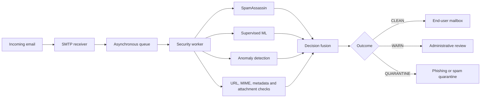
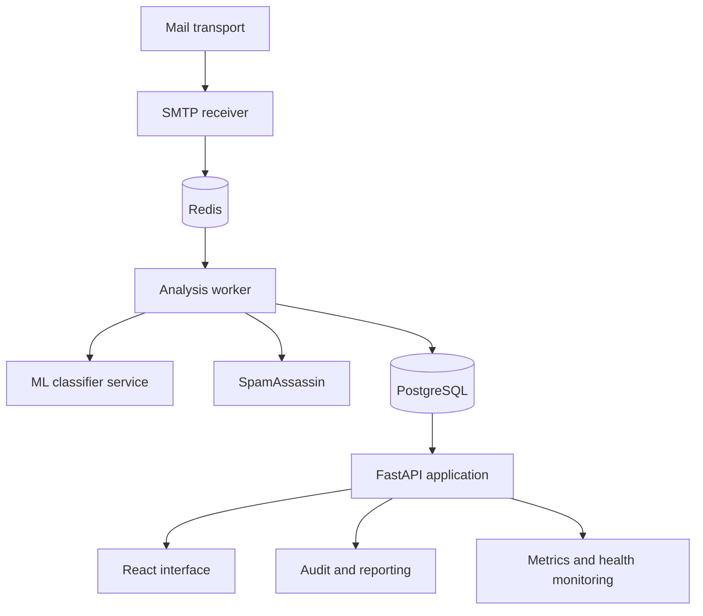
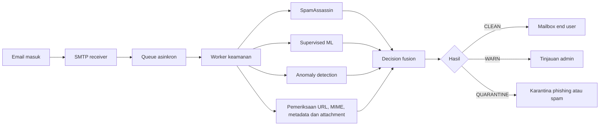
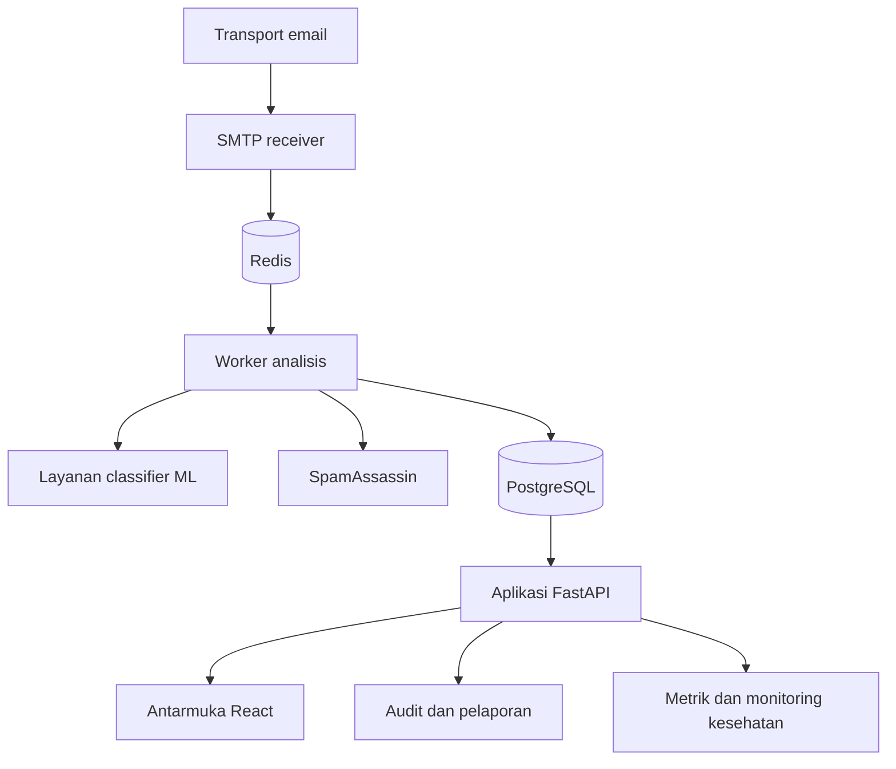

  
  <h1>CogniMail</h1>
  
<strong>ML-Powered Anti-Phishing &amp; Spam Filtering</strong>

  
A self-hosted email security platform with layered detection, mailbox isolation, quarantine, and role-based oversight.

  

    
    
    
    
    
    
  

  

    <a href="#english">English</a> ·
    <a href="#bahasa-indonesia">Bahasa Indonesia</a>
  

---

# English

English is the default language of this document. The complete Indonesian version is available in the [Bahasa Indonesia](#bahasa-indonesia) section.

## Overview

CogniMail is an email security platform designed to receive, analyze, classify, and present email safely. It combines rule-based analysis, supervised machine learning, anomaly detection, URL and metadata inspection, and decision fusion in a single processing pipeline.

The project includes a webmail interface for end users and management capabilities for administrators. Security-sensitive categories are separated from the normal inbox and access is enforced by the backend, not only hidden in the interface.

> [!IMPORTANT]
> This repository includes the application and model artifacts used for inference. It does not currently include a fully reproducible training pipeline, dataset checksums, or verified hold-out evaluation results. This README therefore makes no unsupported claims about model accuracy, precision, recall, F1-score, or training-data provenance.

## Highlights

| Area | Available capability |
| --- | --- |
| Email processing | SMTP reception, asynchronous queue, worker pipeline, and persistent storage |
| Layered detection | SpamAssassin, supervised classification, anomaly detection, URL/domain analysis, MIME and attachment inspection |
| Decision handling | Weighted decision fusion with `CLEAN`, `WARN`, and `QUARANTINE` outcomes |
| Mail experience | Inbox, compose, reply, forward, drafts, sent mail, starred mail, attachments, and search |
| Security review | Separate phishing, spam, and warning review for authorized administrators |
| Access control | Three roles, mailbox-level data isolation, scoped administration, and audit logging |
| Operations | Security analytics, threat reports, system-health information, and monitoring integration |
| Language | English and Bahasa Indonesia in the application interface |

## Roles and access boundaries

CogniMail has exactly three application roles:

| Role | Access boundary |
| --- | --- |
| `superadmin` | Global administration across organizations, administrators, mailboxes, security analytics, threat reports, audit logs, ML-related management, and system health. |
| `admin` | Manages assigned mailboxes and reviews phishing, spam, and warning messages within the administrator's authorized scope. |
| `end user` | Uses the mailbox assigned to them: inbox, compose, reply, forward, drafts, sent, starred, attachments, search, and issue reporting. End users do not receive an additional dashboard and cannot access phishing, spam, or warning review pages. |

Mailbox ownership is validated by the backend. A mailbox cannot read messages, attachments, folders, or security-review data belonging to another mailbox.

## How detection works

```mermaid
flowchart LR
    A[Incoming email] --> B[SMTP receiver]
    B --> C[Asynchronous queue]
    C --> D[Security worker]
    D --> E[SpamAssassin]
    D --> F[Supervised ML]
    D --> G[Anomaly detection]
    D --> H[URL, MIME, metadata and attachment checks]
    E --> I[Decision fusion]
    F --> I
    G --> I
    H --> I
    I --> J{Outcome}
    J -->|CLEAN| K[End-user mailbox]
    J -->|WARN| L[Administrative review]
    J -->|QUARANTINE| M[Phishing or spam quarantine]
```

Detection results can include the final score, model probability, anomaly score, SpamAssassin score, routing reasons, and relevant feature contributions. The information shown depends on the available evidence for each message.

## System architecture

```mermaid
flowchart TB
    Mail[Mail transport] --> Receiver[SMTP receiver]
    Receiver --> Queue[(Redis)]
    Queue --> Worker[Analysis worker]
    Worker --> Classifier[ML classifier service]
    Worker --> Spam[SpamAssassin]
    Worker --> Database[(PostgreSQL)]
    Database --> API[FastAPI application]
    API --> Web[React interface]
    API --> Audit[Audit and reporting]
    API --> Monitor[Metrics and health monitoring]
```

The services are separated so that email reception, analysis, storage, the application API, and the user interface can be operated and observed independently.

## Technology

| Layer | Main technology |
| --- | --- |
| Frontend | React, Vite, TanStack Query, and Lucide icons |
| Application API | Python and FastAPI |
| Data services | PostgreSQL and Redis |
| Email analysis | SpamAssassin, XGBoost, TF-IDF, Isolation Forest, and One-Class SVM |
| Processing | SMTP receiver and asynchronous worker |
| Observability | Prometheus-compatible metrics and Grafana integration |
| Packaging | Docker Compose |

## Security principles

- Mailbox-scoped authorization is enforced for message lists, message details, attachments, folders, and actions.
- Administrative access is limited to the role and scope assigned to the authenticated account.
- Phishing, spam, and warning review is unavailable to end users.
- Credentials and deployment secrets belong in environment configuration and must not be committed to Git.
- User-generated attachments, runtime mail data, databases, logs, and local reports are excluded from version control.
- Security-relevant administrative activity is recorded through audit capabilities.

## Requirement 5.4 coverage

CogniMail implements the main functional scope of **ML-Powered Anti-Phishing and Spam Filtering**:

- automatic analysis of incoming email;
- combined rule-based, supervised, and anomaly-based detection;
- phishing, spam, warning, and clean routing outcomes;
- quarantine and administrator review;
- mailbox-level isolation and role-based access control;
- security explanations and detection metadata;
- threat analytics, reporting, audit information, and operational monitoring.

Some outcomes remain environment-dependent. Real-world mail delivery depends on DNS, TLS, firewall rules, SMTP configuration, relay policy, IP reputation, and external mail providers. Classification quality must be supported by reproducible evaluation evidence before numerical performance claims are made.

## Project team

| Name | Role and responsibility |
| --- | --- |
| **Muhammad Ilham Maulana** | Team Leader &amp; Frontend Developer |
| **Wisnu Alfian Nur Ashar** | Full-Stack Developer, System Architect, API &amp; Feature Engineer |
| **Muhammad Ahda Briliantama** | Full-Stack Developer, ML, QA &amp; Deployment Engineer |
| **Christofer S. R. Sitompul** | Technical Documentation &amp; User Manual |
| **Risly Maria Theresia Worung** | Administration Manual, Evidence &amp; Presentation |

---

# Bahasa Indonesia

Bagian ini merupakan versi Bahasa Indonesia dari dokumentasi utama CogniMail.

## Gambaran umum

CogniMail adalah platform keamanan email yang dirancang untuk menerima, menganalisis, mengklasifikasikan, dan menampilkan email secara aman. Sistem menggabungkan analisis berbasis aturan, supervised machine learning, anomaly detection, pemeriksaan URL dan metadata, serta decision fusion dalam satu pipeline pemrosesan.

Proyek ini menyediakan antarmuka webmail untuk end user dan kemampuan pengelolaan untuk administrator. Kategori yang sensitif dipisahkan dari kotak masuk normal dan aksesnya dibatasi oleh backend, bukan hanya disembunyikan pada antarmuka.

> [!IMPORTANT]
> Repository ini menyediakan aplikasi dan artefak model untuk inference. Saat ini belum tersedia pipeline training yang sepenuhnya reproducible, checksum dataset, dan hasil evaluasi hold-out yang terverifikasi. Karena itu, README ini tidak menyampaikan klaim yang belum terbukti mengenai accuracy, precision, recall, F1-score, atau asal data training.

## Kemampuan utama

| Area | Kemampuan yang tersedia |
| --- | --- |
| Pemrosesan email | Penerimaan SMTP, queue asinkron, worker pemrosesan, dan penyimpanan persisten |
| Deteksi berlapis | SpamAssassin, klasifikasi supervised, anomaly detection, analisis URL/domain, serta pemeriksaan MIME dan attachment |
| Penanganan keputusan | Decision fusion berbobot dengan hasil `CLEAN`, `WARN`, dan `QUARANTINE` |
| Pengalaman email | Kotak masuk, tulis, balas, teruskan, draf, terkirim, berbintang, attachment, dan pencarian |
| Tinjauan keamanan | Tinjauan phishing, spam, dan peringatan yang terpisah untuk administrator berwenang |
| Kontrol akses | Tiga peran, isolasi data per mailbox, cakupan admin, dan audit log |
| Operasional | Analitik keamanan, laporan ancaman, informasi kesehatan sistem, dan integrasi monitoring |
| Bahasa | English dan Bahasa Indonesia pada antarmuka aplikasi |

## Peran dan batas akses

CogniMail hanya memiliki tiga peran aplikasi:

| Peran | Batas akses |
| --- | --- |
| `superadmin` | Administrasi global untuk organisasi, admin, mailbox, analitik keamanan, laporan ancaman, audit log, pengelolaan terkait ML, dan kesehatan sistem. |
| `admin` | Mengelola mailbox yang ditugaskan serta meninjau pesan phishing, spam, dan peringatan sesuai cakupan akses admin. |
| `end user` | Menggunakan mailbox yang diberikan: kotak masuk, tulis, balas, teruskan, draf, terkirim, berbintang, attachment, pencarian, dan laporan masalah. End user tidak memiliki dashboard tambahan dan tidak dapat mengakses halaman tinjauan phishing, spam, atau peringatan. |

Kepemilikan mailbox divalidasi oleh backend. Satu mailbox tidak dapat membaca pesan, attachment, folder, atau data tinjauan keamanan milik mailbox lain.

## Cara kerja deteksi

```mermaid
flowchart LR
    A[Email masuk] --> B[SMTP receiver]
    B --> C[Queue asinkron]
    C --> D[Worker keamanan]
    D --> E[SpamAssassin]
    D --> F[Supervised ML]
    D --> G[Anomaly detection]
    D --> H[Pemeriksaan URL, MIME, metadata dan attachment]
    E --> I[Decision fusion]
    F --> I
    G --> I
    H --> I
    I --> J{Hasil}
    J -->|CLEAN| K[Mailbox end user]
    J -->|WARN| L[Tinjauan admin]
    J -->|QUARANTINE| M[Karantina phishing atau spam]
```

Hasil deteksi dapat menyertakan skor akhir, probabilitas model, skor anomali, skor SpamAssassin, alasan routing, dan kontribusi fitur yang relevan. Informasi yang ditampilkan bergantung pada bukti yang tersedia untuk setiap pesan.

## Arsitektur sistem

```mermaid
flowchart TB
    Mail[Transport email] --> Receiver[SMTP receiver]
    Receiver --> Queue[(Redis)]
    Queue --> Worker[Worker analisis]
    Worker --> Classifier[Layanan classifier ML]
    Worker --> Spam[SpamAssassin]
    Worker --> Database[(PostgreSQL)]
    Database --> API[Aplikasi FastAPI]
    API --> Web[Antarmuka React]
    API --> Audit[Audit dan pelaporan]
    API --> Monitor[Metrik dan monitoring kesehatan]
```

Pemisahan layanan memungkinkan penerimaan email, analisis, penyimpanan, API aplikasi, dan antarmuka pengguna dioperasikan serta dipantau secara independen.

## Teknologi

| Lapisan | Teknologi utama |
| --- | --- |
| Frontend | React, Vite, TanStack Query, dan Lucide icons |
| API aplikasi | Python dan FastAPI |
| Layanan data | PostgreSQL dan Redis |
| Analisis email | SpamAssassin, XGBoost, TF-IDF, Isolation Forest, dan One-Class SVM |
| Pemrosesan | SMTP receiver dan worker asinkron |
| Observability | Metrik kompatibel Prometheus dan integrasi Grafana |
| Packaging | Docker Compose |

## Prinsip keamanan

- Otorisasi berbasis mailbox diterapkan pada daftar pesan, detail pesan, attachment, folder, dan tindakan.
- Akses administrator dibatasi berdasarkan peran dan cakupan akun yang telah diautentikasi.
- Tinjauan phishing, spam, dan peringatan tidak tersedia bagi end user.
- Kredensial dan secret deployment harus disimpan pada environment dan tidak boleh dimasukkan ke Git.
- Attachment pengguna, data email runtime, database, log, dan laporan lokal dikecualikan dari version control.
- Aktivitas administratif yang berkaitan dengan keamanan dicatat melalui kemampuan audit.

## Cakupan requirement 5.4

CogniMail mengimplementasikan ruang lingkup fungsional utama **ML-Powered Anti-Phishing and Spam Filtering**:

- analisis otomatis terhadap email masuk;
- kombinasi deteksi berbasis aturan, supervised, dan anomaly detection;
- routing untuk hasil phishing, spam, peringatan, dan bersih;
- karantina dan tinjauan administrator;
- isolasi mailbox dan role-based access control;
- penjelasan keamanan dan metadata deteksi;
- analitik ancaman, pelaporan, audit, dan monitoring operasional.

Sebagian hasil tetap bergantung pada environment. Pengiriman email nyata dipengaruhi oleh DNS, TLS, firewall, konfigurasi SMTP, kebijakan relay, reputasi IP, dan penyedia email eksternal. Kualitas klasifikasi harus didukung oleh evaluasi yang reproducible sebelum angka performa diklaim.

## Tim proyek

| Nama | Peran dan tanggung jawab |
| --- | --- |
| **Muhammad Ilham Maulana** | Team Leader &amp; Frontend Developer |
| **Wisnu Alfian Nur Ashar** | Full-Stack Developer, System Architect, API &amp; Feature Engineer |
| **Muhammad Ahda Briliantama** | Full-Stack Developer, ML, QA &amp; Deployment Engineer |
| **Christofer S. R. Sitompul** | Technical Documentation &amp; User Manual |
| **Risly Maria Theresia Worung** | Administration Manual, Evidence &amp; Presentation |

---

## License / Lisensi

CogniMail is distributed under the MIT License. See [`LICENSE`](LICENSE) for the complete terms.

CogniMail didistribusikan menggunakan Lisensi MIT. Lihat [`LICENSE`](LICENSE) untuk ketentuan lengkap.
