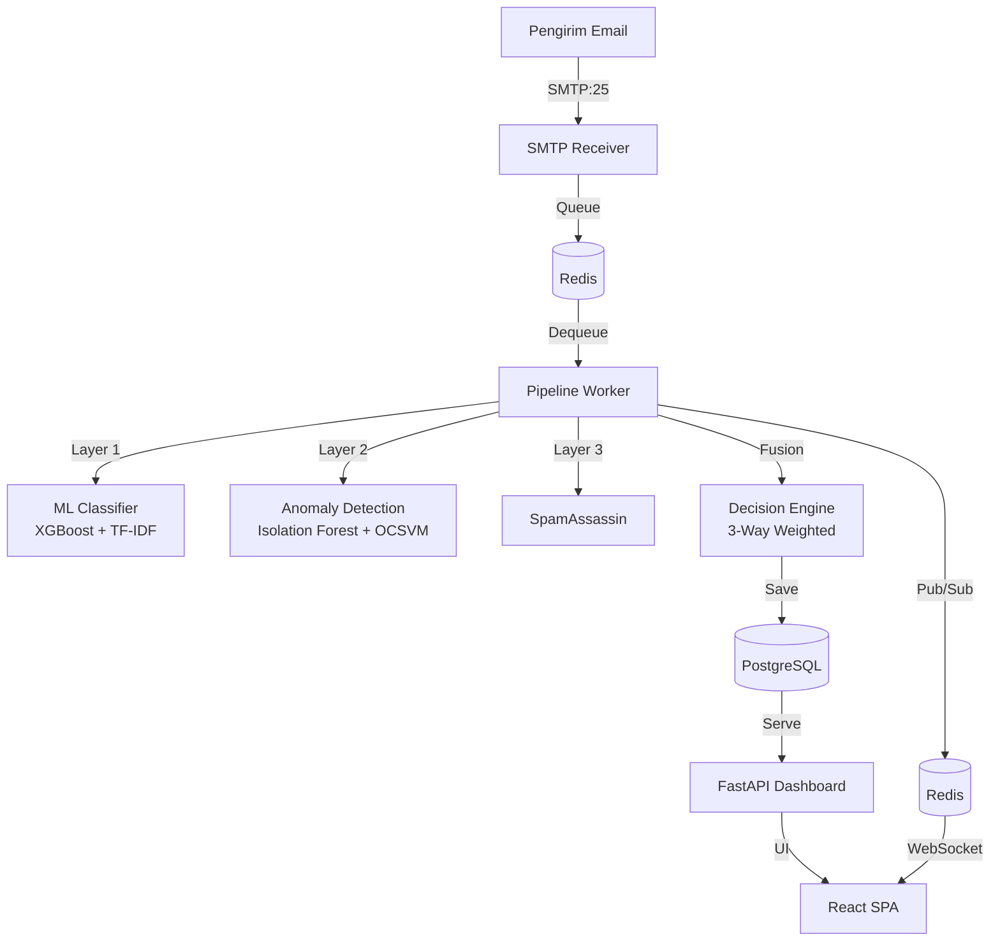

# Sistem CogniMail — Alur Kerja Lengkap

## 1. Arsitektur Sistem



**Layanan terpisah (dapat dioperasikan independen):**

| Layanan | Port | Fungsi |
|---------|------|--------|
| SMTP Receiver | 25 | Menerima email masuk, validasi domain, antre ke Redis |
| Pipeline Worker | - | Memproses email: scan → klasifikasi → fusion → simpan |
| ML Classifier | 8001 | Inference ML (XGBoost + TF-IDF + Anomaly) |
| Dashboard | 8000 | FastAPI backend + React frontend |
| PostgreSQL | 5432 | Penyimpanan data utama |
| Redis | 6379 | Message queue + caching + pub/sub |
| SpamAssassin | 783 | Rule-based spam scoring |

---

## 2. Peran & Hak Akses (3 Role)

| Fitur | Super Admin | Admin | User (Mailbox) |
|-------|-------------|-------|----------------|
| Webmail (inbox, compose, reply) | ✓ | ✓ | ✓ |
| Lihat email terkirim/draft/bintang | ✓ | ✓ | ✓ |
| Laporkan false positive/negative | ✓ | ✓ | ✓ |
| Kelola mailbox sendiri | ✓ | ✓ | ✓ |
| Review karantina (phishing/spam/warn) | ✓ (semua) | ✓ (ditugaskan) | ✗ |
| Kelola mailbox organisasi | ✓ (semua) | ✓ (ditugaskan) | ✗ |
| Buat admin baru | ✓ | ✗ | ✗ |
| Onboard perusahaan baru | ✓ | ✗ | ✗ |
| Atur pengaturan sistem | ✓ | ✗ | ✗ |
| Lihat log audit | ✓ | ✗ | ✗ |
| Lihat kesehatan sistem | ✓ | ✗ | ✗ |
| Kelola training ML | ✓ | ✗ | ✗ |
| Export laporan PDF/Excel | ✓ | ✓ | ✗ |
| API Keys | ✓ | ✓ | ✗ |

---

## 3. Super Admin — Semua Fitur Sidebar

### 3.1 Overview (Ringkasan Sistem)
Halaman dashboard super admin dengan statistik global:
- Total email diproses
- Jumlah quarantine, warn, clean
- Jumlah admin, user, mailbox
- Grafik ancaman harian (14 hari)
- Status layanan (PostgreSQL, Redis, Classifier)

### 3.2 Pemantauan (Tracking Admin)
Memantau aktivitas semua admin:
- Statistik per-admin (jumlah mailbox dikelola, email diproses)
- Aktivitas mencurigakan
- Log aksi admin (login, create/delete mailbox, release email)
- Export trail audit (CSV, Excel, PDF)

### 3.3 Manajemen Admin
**Fitur:**
- **Lihat daftar admin** — username, role, status aktif, mailbox ditugaskan
- **Cari admin** — by username
- **Buat admin baru** — username, password, role (superadmin/admin)
- **Edit admin** — role, status aktif, reset password
- **Nonaktifkan admin** — soft delete ( tidak bisa login)
- **Hapus admin permanen** — hard delete

### 3.4 Manajemen Email (Mailbox)
**Fitur:**
- **Lihat semua mailbox** — email, domain, sender_name, status, admin ditugaskan
- **Cari mailbox** — by email
- **Buat mailbox baru** — email, password, sender_name, assign ke admin
- **Edit mailbox** — email, domain, sender_name, assign ke admin lain, aktif/nonaktif
- **Hapus mailbox** — permanen (semua data email ikut terhapus)
- **Reset password mailbox**
- **Atur forwarding** — target email, enable/disable, keep copy
- **Generate autologin token** — login langsung ke mailbox tanpa password
- **Generate admin impersonation token** — login sebagai admin tertentu

### 3.5 Email Analytics
Analitik per-mailbox:
- Jumlah email (inbox, sent, quarantine, dll)
- Skor ancaman rata-rata
- Domain pengirim teratas
- Tren harian
- Hasil autentikasi (SPF, DKIM, DMARC)

### 3.6 Laporan Ancaman (Threat Breakdown)
- **Breakdown kategori** — phishing vs spam vs warn vs clean
- **Top recipient** — mailbox paling sering ditarget
- **Top sender** — pengirim paling sering terdeteksi
- **Tren harian** — grafik ancaman per hari
- Filter berdasarkan tanggal, kategori, mailbox

### 3.7 Log Audit
Semua aktivitas administratif tercatat:
- Login/logout admin
- Create/update/delete mailbox
- Release/quarantine email
- Change password
- Update settings
- Training ML
- Export laporan
- Filter berdasarkan user, aksi, tanggal

### 3.8 Laporan Email (Reports)
- **Lihat semua laporan/tiket** dari user (false positive, masalah)
- **Update status** — open, in_progress, resolved
- **Balas laporan** — admin memberikan tanggapan

### 3.9 Kesehatan Sistem (System Health)
Status semua layanan secara real-time:
- PostgreSQL — connected/error
- Redis — connected/error
- ML Classifier — online/offline (versi model, fitur)
- SMTP Receiver — listening/stopped
- Pipeline Worker — active/idle
- SpamAssassin — reachable/unreachable
- WebSocket connections — jumlah client

### 3.10 Pelatihan ML (ML Training)
**Fitur:**
- **Lihat training samples** — semua feedback user (false positive/negative)
- **Filter samples** — status (pending/approved/rejected), tipe feedback
- **Approve/reject sample** — tentukan apakah sample layak untuk retraining
- **Koreksi label** — ubah label jika feedback salah
- **Hapus sample** — jika tidak relevan
- **Export dataset** — download CSV untuk analysis
- **Statistik dataset** — jumlah per status, tipe, label
- **Trigger retraining** — jalankan retraining model (min 100 sample)

**Alur retraining:**
1. User report false positive/negative → TrainingSample dibuat (status: pending)
2. Super admin review & approve sample
3. Klik "Retrain Model" → background task berjalan
4. Worker mengambil approved samples + data asli
5. Train XGBoost baru dengan validasi (min accuracy 85%)
6. Jika accuracy turun > 5% dari model sebelumnya → rollback otomatis
7. Model baru disimpan dengan versioning, model lama di-backup
8. Audit log mencatat hasil retraining

### 3.11 Pengaturan (Settings)
**Konfigurasi sistem:**
- **Domain Organisasi** — domain utama untuk mailbox (contoh: `zenime.my.id`)
- **Thresholds**:
  - THRESHOLD_QUARANTINE — skor untuk karantina (default: 0.70)
  - THRESHOLD_WARN — skor untuk peringatan (default: 0.30)
  - ML_WEIGHT, SA_WEIGHT, ANOMALY_WEIGHT — bobot fusion
- **IMAP Config** — untuk forwarding (opsional)
- **Profile** — foto profil, username

---

## 4. Admin — Fitur Sidebar

### 4.1 Overview
Statistik untuk mailbox yang ditugaskan ke admin tersebut:
- Jumlah email, quarantine, warn per mailbox
- Total email diproses

### 4.2 Manajemen Email
Sama seperti super admin, tapi **terbatas pada mailbox yang ditugaskan**:
- Lihat, buat, edit, hapus mailbox (hanya yang assigned)
- Reset password, atur forwarding
- Generate autologin token

### 4.3 Email Analytics
Analitik untuk mailbox yang ditugaskan:
- Statistik per-mailbox
- Top senders
- Tren ancaman

### 4.4 Review Karantina
**Fitur:**
- Lihat email di karantina (phishing, spam, WARN)
- Filter berdasarkan kategori, mailbox, pencarian
- **Release email** — pindahkan ke inbox user
- **Confirm spam** — tetapkan sebagai spam
- **Lihat detail deteksi** — skor ML, SA, anomaly, SHAP XAI, routing reason
- **Bulk actions** — release/confirm multiple emails

### 4.5 Detection Logs
Semua email yang diproses (CLEAN, WARN, QUARANTINE):
- Status terakhir
- Info aksi (release, confirm spam, dll)
- Filter berdasarkan kategori, status

### 4.6 Laporan (Reports)
Laporan dari user yang emailnya masuk ke mailbox admin tersebut.

### 4.7 Settings
Pengaturan profile admin (username, password, foto).

---

## 5. User (Mailbox) — Fitur Webmail

### 5.1 Inbox
Email yang lolos deteksi (CLEAN) masuk ke inbox.
- **Fitur:** baca, search, filter, star, snooze, delete, bulk actions
- **Indikator:** unread count, lampiran, urgent
- **Threading:** email terkait dikelompokkan

### 5.2 Compose (Tulis Email)
- To, Cc, Bcc
- Subject, body (rich text)
- Lampiran (file upload)
- Simpan draft
- Kirim via SMTP relay atau direct MX

### 5.3 Starred (Berbintang)
Email yang ditandai bintang — akses cepat.

### 5.4 Sent (Terkirim)
Email yang berhasil dikirim.

### 5.5 Draft
Email yang disimpan sebagai draft — dapat diedit dan dikirim.

### 5.6 All Mail
Semua email (CLEAN, WARN, QUARANTINE) — **hanya admin/superadmin** yang bisa lihat.

### 5.7 Trash
Email yang dihapus — bisa di-restore.

### 5.8 Phishing / Spam / WARN
Email yang dikarantina — **hanya admin/superadmin** yang bisa lihat dan release.

### 5.9 Report
User dapat melaporkan:
- **False positive** — email bersih tapi masuk karantina
- **False negative** — email berbahaya tapi lolos ke inbox
- **Masalah teknis** — laporan umum

Proses:
1. User klik "Report" pada email
2. Pilih tipe laporan + komentar
3. TrainingSample dibuat (status: pending)
4. Feedback dicatat
5. Super admin review di menu "Pelatihan ML"

---

## 6. Deteksi Email — Alur Lengkap

```mermaid
flowchart LR
    A[Email Masuk] --> B[SMTP Receiver]
    B --> C[Redis Queue]
    C --> D[Pipeline Worker]
    D --> E[Parse Email]
    E --> F[SpamAssassin]
    E --> G[ML Classifier]
    G --> G1[Layer 1: XGBoost<br/>TF-IDF + 20 Fitur Struktur]
    G --> G2[Layer 2: Anomaly<br/>Isolation Forest + OCSVM]
    F --> H[Decision Fusion]
    G1 --> H
    G2 --> H
    H --> I{Fused Score}
    I -->|< 0.30| J[CLEAN → Inbox User]
    I -->|0.30 - 0.70| K[WARN → Review Admin]
    I -->|> 0.70| L[QUARANTINE → Karantina]
    H --> M{Hard Override?}
    M -->|SA >= 15| L
    M -->|ML >= 0.95| L
    M -->|Anomaly >= 0.90| L
    M -->|ML >= 0.995| L
    J --> N[Forward ke Email Asli<br/>(jika dikonfigurasi)]
```

### Layer Deteksi

**Layer 1 — Supervised ML (XGBoost):**
- 50000 fitur TF-IDF dari subject + body
- 20 fitur struktural (jumlah URL, domain mencurigakan, urgency, dll)
- Output: probabilitas spam (0.0 - 1.0)
- SHAP XAI untuk explainability

**Layer 2 — Unsupervised Anomaly Detection:**
- Isolation Forest + One-Class SVM
- 18 fitur (URL, attachment, SPF/DKIM/DMARC, dll)
- Output: anomaly score (0.0 - 1.0)

**Layer 3 — Rule-based (SpamAssassin):**
- 12+ aturan spam klasik
- Output: skor mentah (0 - 20+)

### Decision Fusion

```python
fused_score = ML * 0.50 + SA * 0.25 + Anomaly * 0.25
```

Hard override (langsung QUARANTINE):
- SA score >= 15
- ML prob >= 0.95
- Anomaly score >= 0.90
- ML prob >= 0.995 (decisive, cukup 1 bukti)

Evidence-gated: QUARANTINE butuh minimal 2 bukti kuat.

---

## 7. Evasion Detection

Modul `classifier/evasion_detection.py` mendeteksi teknik penghindaran:
- **Homograph** — karakter Cyrillic mirip Latin (раурзl → paypal)
- **Zero-width characters** — karakter tak terlihat dalam teks
- **Obfuscation** — eval(), base64, fromCharCode, javascript:
- **Suspicious encoding** — double URL encoding, excessive encoding
- **RTL override** — Unicode RTL override untuk spoofing filename

Hasil deteksi tersedia di `EmailFeatures.evasion_detected` dan `.evasion_confidence`.

---

## 8. Keamanan

- **JWT authentication** — HS256, 480 menit expiry
- **bcrypt password hashing** — untuk semua akun
- **Role-based access control** — 3 role dengan batasan ketat
- **Mailbox-scoped authorization** — diverifikasi di backend
- **Rate limiting** — 10-20 req/min per endpoint
- **TLS/STARTTLS** — untuk SMTP receiver
- **API Keys** — untuk integrasi otomatis
- **Audit logging** — semua aksi administratif tercatat
- **Security headers** — CSP, X-Frame-Options, HSTS
- **SQL injection protection** — via SQLAlchemy ORM

---

## 9. Diagram Alur User

```
                    ┌──────────────────────┐
                    │   Login Dashboard     │
                    │ (username + password) │
                    └──────┬───────────────┘
                           │
                    ┌──────▼───────────────┐
                    │  Role Check (JWT)     │
                    └──────┬───────────────┘
                           │
           ┌───────────────┼───────────────┐
           │               │               │
    ┌──────▼──────┐ ┌──────▼──────┐ ┌──────▼──────┐
    │ Super Admin │ │    Admin    │ │    User     │
    │ (semua      │ │ (mailbox    │ │ (webmail    │
    │  fitur)     │ │  terbatas)  │ │  saja)      │
    └──────┬──────┘ └──────┬──────┘ └──────┬──────┘
           │               │               │
    ┌──────▼──────┐ ┌──────▼──────┐ ┌──────▼──────┐
    │ Sidebar:    │ │ Sidebar:    │ │ Sidebar:    │
    │ • Overview  │ │ • Overview  │ │ • Inbox     │
    │ • Tracking  │ │ • Email     │ │ • Compose   │
    │ • Admins    │ │ • Analytics │ │ • Starred   │
    │ • Email     │ │ • Review    │ │ • Sent      │
    │ • Analytics │ │ • Logs      │ │ • Draft     │
    │ • Threat    │ │ • Reports   │ │ • Report    │
    │ • Audit     │ │ • Settings  │ │             │
    │ • Reports   │ │             │ │             │
    │ • Health    │ │             │ │             │
    │ • ML Train  │ │             │ │             │
    │ • Settings  │ │             │ │             │
    └─────────────┘ └─────────────┘ └─────────────┘
```
