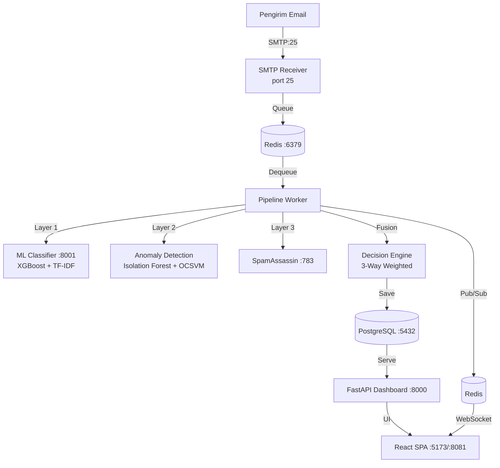
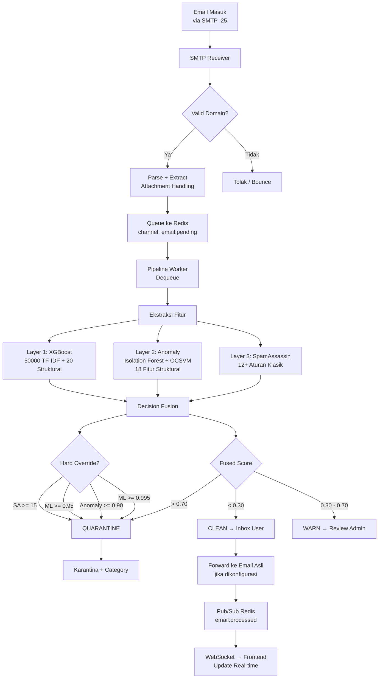

# Sistem CogniMail — Alur Kerja Lengkap

## 1. Arsitektur Sistem



**Layanan terpisah:**

| Layanan | Port | Fungsi |
|---------|------|--------|
| SMTP Receiver | 25 | Menerima email masuk, validasi domain, antre ke Redis, parse & attachment handling |
| Pipeline Worker | - | Dequeue dari Redis, panggil 3 layer deteksi, fusion, simpan ke DB |
| ML Classifier | 8001 | Inference XGBoost + TF-IDF + Isolation Forest + OCSVM, SHAP XAI |
| Dashboard | 8000 | FastAPI backend + serve React frontend, WebSocket bridge, auth, RBAC |
| PostgreSQL | 5432 | Database utama — quarantine_emails, users, mailbox, audit_log, dll |
| Redis | 6379 | Message queue (email:processed), pub/sub untuk WebSocket real-time |
| SpamAssassin | 783 | Rule-based spam scoring (opsional, fallback jika tidak tersedia) |

---

## 2. Peran & Hak Akses (3 Role)

| Fitur | Super Admin | Admin | User (Mailbox) |
|-------|-------------|-------|----------------|
| Webmail (inbox, compose, reply, forward) | ✓ | ✓ | ✓ |
| Lihat email terkirim/draft/bintang | ✓ | ✓ | ✓ |
| Laporkan false positive/negative | ✓ | ✓ | ✓ (hanya report) |
| Kelola mailbox sendiri (profile, avatar) | ✓ | ✓ | ✓ |
| Review karantina (phishing/spam/warn) | ✓ **semua** | ✓ **ditugaskan** | ✗ |
| Kelola mailbox organisasi | ✓ **semua** | ✓ **ditugaskan** | ✗ |
| Buat admin baru | ✓ | ✗ | ✗ |
| Onboard perusahaan baru | ✓ | ✗ | ✗ |
| Atur pengaturan sistem | ✓ | ✗ | ✗ |
| Lihat log audit | ✓ **semua** | ✓ **org sendiri** | ✗ |
| Lihat kesehatan sistem | ✓ | ✗ | ✗ |
| Kelola training ML | ✓ | ✗ | ✗ |
| Export laporan PDF/Excel | ✓ | ✓ **org sendiri** | ✗ |
| API Keys | ✓ | ✓ | ✗ |
| Lihat semua email (All Mail) | ✓ | ✓ | ✗ |
| Restore dari trash | ✓ | ✓ | ✗ |

**Pembatasan akses:**

- **Mailbox user** hanya bisa melihat email CLEAN yang sudah direlease + SENT/DRAFT miliknya
- **Admin** hanya bisa melihat mailbox yang ditugaskan ke dirinya (`AdminMailbox.assigned_to`)
- **Super admin** bisa melihat semua data tanpa batasan organisasi
- Audit dibatasi: admin hanya lihat log user di organisasinya

---

## 3. SUPER ADMIN — Semua Fitur Sidebar Detail

Login: `POST /api/auth/login` → JWT disimpan di cookie `access_token` (httponly, 480 menit).

Sidebar super admin terdefinisi di `AdminShell.jsx` → `SUPERADMIN_NAV_ITEMS`:
```
overview → track → users → email → analytics → threat → activity → reports → health → training → settings
```

Semua halaman super admin di-render di `SuperadminDashboardOverview.jsx` dengan tab parameter `?tab=...`.

---

### 3.1 Overview (?tab=overview)

**Komponen:** `SuperadminDashboardOverview.jsx` — tab "overview" secara default.

**Tujuan:** Dashboard ringkasan sistem — statistik global semua organisasi, mailbox, dan email.

**Tampilan & Aksi:**
- Kartu statistik: Total Email, Total Quarantine, Total Warn, Total Clean
- Kartu pengguna: Total Admin, Total Mailbox
- Grafik ancaman 14 hari (`/api/metrics`)
- Status layanan: PostgreSQL, Redis, Classifier (`/api/health`)
- Tombol refresh data

**API yang dipanggil:**
| Endpoint | Method | Fungsi |
|----------|--------|--------|
| `/api/stats` | GET | Statistik global: total/quarantine/warn/clean/unread/sent/draft/starred + skor rata-rata |
| `/api/metrics` | GET | Top 10 sender, daily stats 14 hari, feedback count |
| `/api/health` | GET | Status koneksi database, redis, classifier, WS connections |
| `/api/admin/mailboxes` | GET | Daftar semua mailbox (untuk total mailbox count) |

**Database:** `quarantine_emails`, `admin_mailbox`, `users`, `audit_log`, `pipeline_metrics`

---

### 3.2 Pemantauan Admin (?tab=track)

**Komponen:** `SuperadminDashboardOverview.jsx` — tab "track".

**Tujuan:** Memantau aktivitas semua admin, statistik per-admin, dan audit trail.

**Tampilan & Aksi:**
- **Tabel aktivitas admin** — tabel dengan kolom: Timestamp, User, Action, Email ID, Details, IP Address
- **Statistik per-admin** — jumlah mailbox dikelola, email diproses per admin
- **Filter** — berdasarkan event_type, username
- **Export** — CSV, Excel (XLSX), PDF — `GET /api/admin/track/export?format=csv|excel|pdf`
- **Pagination** — 50 item per halaman
- **Data mentah** — kolom: username, action (release, confirm_spam, create_mailbox, dll), email_id, ip_address, details, notes, created_at

**API:**
| Endpoint | Method | Fungsi |
|----------|--------|--------|
| `/api/audit-log` | GET | Paginated audit log — filter event_type, username |
| `/api/admin/track/export` | GET | Export audit trail — format csv/excel/pdf |

**Database:** `audit_log`

**Aksi yang tercatat (AuditLog.action):**
`create_user`, `update_user`, `delete_user`, `create_mailbox`, `update_mailbox`, `delete_mailbox`, `release`, `confirm_spam`, `report_false_positive`, `change_password`, `update_settings`, `update_profile`, `update_profile_avatar`, `change_mailbox_password`, `update_mailbox_forwarder`, `reactivate_mailbox`, `deactivate_mailbox`, `delete_mailbox_permanent`, `save_email_draft`, `send_email_send`, `send_email_reply`, `send_email_forward`, `send_email_share`, `send_email_failed`, `manual_analyze`, `train_model`, `toggle_starred`, `snooze_email`, `discard_draft`, `move_to_trash`, `delete_permanent`, `restore`, `create_api_key`, `delete_api_key`, `generate_autologin_token`, `onboard_company`, `train_model`

---

### 3.3 Manajemen Admin (?tab=users)

**Komponen:** `SuperadminUserManagement.jsx`

**Tujuan:** CRUD akun admin — super admin mengelola semua admin.

**Tampilan & Aksi:**

**Daftar admin:**
- Tabel: No, Username, Role, Status (aktif/tidak aktif), Organization, Aksi
- Pencarian admin by username (`/api/admin/users/search?q=...`)

**Buat admin baru:**
- Form: Username, Password (min 8, harus ada huruf besar, kecil, angka, spesial), Role (admin/superadmin)
- `POST /api/admin/users` — superadmin only
- Audit log: "create_user"

**Edit admin:**
- `PUT /api/admin/users/{username}` — superadmin only
- Bisa ubah: is_active (aktif/nonaktif), password
- Jika nonaktifkan → tidak bisa login
- Audit log: "update_admin_status"

**Hapus admin:**
- `DELETE /api/admin/users/{username}` — superadmin only
- Tidak bisa hapus diri sendiri
- Cek: admin tidak boleh memiliki mailbox aktif yang ditugaskan
- Cek: minimal 1 superadmin aktif harus tersisa
- **Tidak hard delete** — hanya set is_active = false

**API:**
| Endpoint | Method | Fungsi |
|----------|--------|--------|
| `/api/admin/users` | GET | Daftar semua admin + organization |
| `/api/admin/users/search` | GET | Search admin by username |
| `/api/admin/users` | POST | Buat admin baru |
| `/api/admin/users/id/{user_id}` | PATCH | Update admin (admin_routes.py) |
| `/api/admin/users/id/{user_id}` | DELETE | Hard delete admin (admin_routes.py) |
| `/api/admin/users/{username}` | PUT | Update admin (app.py) |
| `/api/admin/users/{username}` | DELETE | Nonaktifkan admin (app.py) |

**Database:** `users` (role=ADMIN), `organization`

---

### 3.4 Manajemen Email / Mailbox (?tab=email)

**Komponen:** `SuperadminUserManagement.jsx` — tab "email" atau halaman terpisah.

**Tujuan:** CRUD mailbox (kotak email) — setiap mailbox punya admin penanggung jawab.

**Tampilan & Aksi:**

**Daftar mailbox:**
- Tabel: Email, Domain, Sender Name, Status (aktif/tidak), Assigned To (admin), Created By, Forward To, Forward Enabled, Aksi
- Search by email

**Buat mailbox baru:**
- `POST /api/admin/mailboxes` — rate limited 10/min
- Form: Email, Password (min 8, huruf besar, kecil, angka, spesial), Sender Name, Assign ke admin
- Domain otomatis dari email

**Edit mailbox:**
- `PUT /api/admin/mailboxes/{mailbox_id}`
- Bisa ubah: email, domain, sender_name, assign_to (ganti admin penanggung jawab), is_active

**Hapus mailbox permanen:**
- `DELETE /api/admin/mailboxes/{mailbox_id}`
- Menghapus SEMUA data terkait: email, feedback, training samples, audit log, audit trail, access records
- Fungsi `_permanently_delete_mailbox()` — hard delete cascade

**Reset password:**
- `PUT /api/admin/mailboxes/{mailbox_id}/password` — rate limited 10/min
- Password minimal 8 karakter

**Atur forwarding:**
- `PUT /api/admin/mailboxes/{mailbox_id}/forwarder`
- Konfigurasi forward_to, forward_enabled, forward_keep_copy

**Generate autologin token:**
- `POST /api/admin/mailboxes/{mailbox_id}/autologin-token`
- Token sekali pakai, TTL 60 detik
- `POST /api/mailboxes/autologin` — redeem token → dapat mailbox_token cookie
- Admin bisa login ke webmail tanpa password

**Generate admin impersonation token:**
- `POST /api/admin/mailboxes/{mailbox_id}/admin-autologin-token`
- Token untuk super admin login sebagai admin tertentu

**API:**
| Endpoint | Method | Fungsi |
|----------|--------|--------|
| `/api/admin/mailboxes` | GET | Daftar mailbox dengan forward, assigned, storage |
| `/api/admin/mailboxes/{id}` | PUT | Update mailbox (email, sender, active, assign) |
| `/api/admin/mailboxes/{id}` | DELETE | Hapus permanen + cascade |
| `/api/admin/mailboxes` | POST | Buat mailbox baru |
| `/api/admin/mailboxes/{id}/password` | PUT | Update password mailbox |
| `/api/admin/mailboxes/{id}/change-password` | POST | Change password (app.py) |
| `/api/admin/mailboxes/{id}/forwarder` | PUT | Atur forwarding |
| `/api/admin/mailboxes/{id}/autologin-token` | POST | Generate autologin token |
| `/api/admin/mailboxes/{id}/admin-autologin-token` | POST | Generate admin impersonation token |
| `/api/admin/mailboxes/by-email` | GET | Cari mailbox by email |
| `/api/admin/mailboxes/id/{id}` | PATCH | Partial update (admin_routes.py) |
| `/api/admin/mailboxes/id/{id}` | DELETE | Hard delete (admin_routes.py) |
| `/api/mailboxes/autologin` | POST | Redeem autologin token |
| `/api/admin/autologin` | POST | Redeem admin impersonation token |

**Database:** `admin_mailbox`, `admin_mailbox_access`, `quarantine_emails`, `feedback`, `training_samples`, `audit_log`, `audit_trail`

---

### 3.5 Email Analytics (?tab=analytics)

**Komponen:** `SuperadminUserAnalytics.jsx`

**Tujuan:** Analitik per-mailbox — lihat statistik email untuk mailbox tertentu.

**Tampilan & Aksi:**
- **Pilih mailbox** — combobox atau search
- **Statistik** — total email, jumlah CLEAN/WARN/QUARANTINE
- **Skor rata-rata** — fused score, ML probability, anomaly score
- **Domain pengirim teratas** — top 10 sender by count
- **Tren harian** — grafik 14 hari (total email + quarantine per hari)
- **Feedback count** — jumlah feedback dari user mailbox itu
- **Hasil autentikasi** — SPF, DKIM, DMARC breakdown per email

**API:**
| Endpoint | Method | Fungsi |
|----------|--------|--------|
| `/api/metrics?mailbox=X&mailbox_id=Y` | GET | Metrics per mailbox (top_senders, daily_stats, counts) |
| `/api/stats?mailbox=X&mailbox_id=Y` | GET | Statistik terperinci per mailbox |

**Database:** `quarantine_emails`, `feedback`

---

### 3.6 Laporan Ancaman / Threat Breakdown (?tab=threat)

**Komponen:** `ThreatReportPage.jsx`

**Tujuan:** Analisis ancaman terpusat — breakdown phishing, spam, warn, clean.

**Tampilan & Aksi:**
- **Breakdown kategori** — pie chart atau bar chart: phishing vs spam vs warn vs clean
- **Top recipient** — mailbox yang paling sering ditarget ancaman
- **Top sender** — alamat pengirim yang paling sering terdeteksi berbahaya
- **Tren harian** — grafik ancaman per hari (14 hari)
- **Filter** — berdasarkan rentang tanggal, kategori, mailbox spesifik

**API:**
| Endpoint | Method | Fungsi |
|----------|--------|--------|
| `/api/stats` | GET | Statistik global termasuk breakdown kategori |
| `/api/metrics` | GET | Metrics untuk chart dan top lists |

**Database:** `quarantine_emails`

---

### 3.7 Log Audit (?tab=activity)

**Komponen:** `AuditPage.jsx`

**Tujuan:** Log semua aktivitas administratif — akuntabilitas penuh.

**Tampilan & Aksi:**
- **Tabel** — Timestamp, User, Action, Email ID, Details, IP Address
- **Filter** — event_type (dropdown aksi), username (search)
- **Pagination** — 50 item/halaman
- **Export** — CSV, Excel, PDF (modal export)
- **Mode embedded** — `AuditLogEmbed.jsx` untuk embed di halaman lain

**Perbedaan super admin vs admin:**
- Super admin: lihat **semua** log
- Admin: lihat hanya log user di organisasinya sendiri

**API:**
| Endpoint | Method | Fungsi |
|----------|--------|--------|
| `/api/audit-log` | GET | Paginated audit log |
| `/api/admin/track/export` | GET | Export PDF/Excel/CSV |

**Database:** `audit_log`

---

### 3.8 Laporan / Reports (?tab=reports)

**Komponen:** `SuperadminDashboardOverview.jsx` — tab "reports".

**Tujuan:** Tiket laporan dari user — false positive, masalah teknis, dll.

**Tampilan & Aksi:**
- **Daftar laporan** — Subject, Category (false_positive, bug, question, access, other), Status (open/in_progress/resolved), Dari (mailbox/username), Tanggal
- **Update status** — open → in_progress → resolved
- **Balas laporan** — admin memberikan tanggapan
- **Filter** — based on category, status

**Alur laporan:**
1. User buka modal report (dari sidebar atau menu user)
2. Isi subject, message, pilih kategori
3. `POST /api/reports` → Report dibuat
4. Super admin review di menu Reports

**API:**
| Endpoint | Method | Fungsi |
|----------|--------|--------|
| `/api/reports` | GET | Daftar laporan |
| `/api/reports` | POST | Buat laporan baru (dari user) |
| `/api/reports/{id}` | PATCH | Update status laporan |

**Database:** `reports`

---

### 3.9 Kesehatan Sistem (?tab=health)

**Komponen:** `SuperadminSystemHealth.jsx`

**Tujuan:** Dashboard monitoring status semua layanan secara real-time.

**Tampilan & Aksi:**
- **Status card per layanan:**
  - **PostgreSQL** — connected ✅ / error ❌ (query test `SELECT COUNT(*)`)
  - **Redis** — connected ✅ / error ❌ (ping test)
  - **ML Classifier** — online ✅ / offline ❌ (HTTP GET /health)
  - **WebSocket** — jumlah koneksi aktif
- **Versi sistem** — "3.0.0"
- **Uptime** — N/A (belum diimplementasikan)
- **Auto-refresh** — polling periodik

**API:**
| Endpoint | Method | Fungsi |
|----------|--------|--------|
| `/api/health` | GET | Status database, redis, classifier, WS connections |

**Database:** — (hanya test koneksi)

---

### 3.10 Pelatihan ML (?tab=training)

**Komponen:** `SuperadminTrainingPage.jsx`

**Lokasi khusus:** `/super-admin/training` (bukan tab, path terpisah)

**Tujuan:** Kelola training samples — review feedback user, approve/reject untuk retraining model.

**Tampilan & Aksi:**

**Daftar training samples:**
- Tabel: No, Subject, Sender, Original Label, Feedback Type (false_positive/false_negative), Corrected Label, Status (pending/approved/rejected), Reported By, Tanggal, Notes, Aksi
- **Filter by status:** Semua / Pending / Approved / Rejected
- **Filter by feedback type:** Semua / False Positive / False Negative

**Aksi per sample:**
- **Approve** ✅ — tandai sample layak retraining
- **Reject** ❌ — tolak sample
- **Koreksi label** ✏️ — ubah corrected_label jika feedback salah
- **Hapus sample** 🗑️ — jika tidak relevan

**Statistik dataset:**
- Total samples, Pending, Approved, Rejected
- Berdasarkan feedback type
- Berdasarkan corrected label

**Export dataset:**
- Download CSV — semua training sample yang approved

**Trigger retraining:**
- Tombol "Retrain Model" — hanya aktif jika approved samples ≥ 100
- `POST /training/retrain` → background task async

**Alur retraining:**
1. User report false positive/negative → `TrainingSample` dibuat (status: pending)
2. Super admin review → approve atau reject
3. Jika min 100 sample approved → klik "Retrain Model"
4. Backend:
   - Ambil semua approved training samples
   - Gabung dengan data email asli dari `quarantine_emails`
   - Train XGBoost baru dengan validation split
   - Evaluasi: min accuracy 85%
   - Jika accuracy turun > 5% dari model sebelumnya → **rollback otomatis**
   - Simpan model baru dengan versioning (model lama di-backup)
5. Audit log: "train_model" — mencatat versi, accuracy, sample count

**API:**
| Endpoint | Method | Fungsi |
|----------|--------|--------|
| `/api/training/samples` | GET | Daftar training samples dengan filter |
| `/api/training/samples/{id}/approve` | POST | Approve sample |
| `/api/training/samples/{id}/reject` | POST | Reject sample |
| `/api/training/samples/{id}/relabel` | PUT | Koreksi label |
| `/api/training/samples/{id}` | DELETE | Hapus sample |
| `/api/training/export` | GET | Download dataset CSV |
| `/api/training/retrain` | POST | Trigger retraining |
| `/api/training/status` | GET | Status retraining terakhir |

**Database:** `training_samples`, `quarantine_emails`, `audit_log`

---

### 3.11 Pengaturan (?tab=settings)

**Komponen:** `SettingsPage.jsx`

**Tujuan:** Konfigurasi sistem global — hanya super admin yang bisa akses.

**Tampilan & Aksi:**

**Domain Organisasi:**
- Input domain (contoh: `zenime.my.id`)
- Disimpan di `SystemSetting` (key: "organization_domain")
- Jika diubah → validasi tidak ada mailbox dengan domain berbeda
- Update `VITE_MAIL_DOMAIN` environment variable

**Thresholds Deteksi:**
- `THRESHOLD_QUARANTINE` — skor fused untuk karantina (default: 0.70)
- `THRESHOLD_WARN` — skor fused untuk peringatan (default: 0.30)
- `FUSION_ML_WEIGHT` — bobot ML dalam fusion (default: 0.50)
- `FUSION_SA_WEIGHT` — bobot SpamAssassin (default: 0.25)
- `FUSION_ANOMALY_WEIGHT` — bobot anomaly (default: 0.25)

**IMAP Konfigurasi (opsional):**
- IMAP Host, Port, Username
- Test connection — `POST /api/settings/test-imap`

**Lainnya:**
- Poll interval (detik)
- Protected domains
- Whitelist senders
- Admin alert email
- Max quarantine days (retensi data)

**API:**
| Endpoint | Method | Fungsi |
|----------|--------|--------|
| `/api/settings` | GET | Ambil semua settings (tanpa password IMAP) |
| `/api/settings` | POST | Update settings — superadmin only |
| `/api/settings/test-imap` | POST | Test koneksi IMAP |

**Database:** `system_settings` (persisted), environment variables (runtime)

---

### 3.12 Onboard Perusahaan Baru

**Tujuan:** Fitur tambahan di super admin untuk menambahkan perusahaan baru secara massal.

**Tampilan & Aksi:**
- Form: company_name, admin_username, admin_password, users list (username, email, password)
- `POST /api/admin/onboard-company`
- Proses:
  1. Buat Organization baru
  2. Buat admin user untuk perusahaan
  3. Buat 3 mailbox default: `inbox@domain`, `it-support@domain`, `security-alerts@domain`
  4. Assign mailbox ke admin
  5. Buat user-User dari daftar
  6. Grant AdminMailboxAccess ke semua user

**API:**
| Endpoint | Method | Fungsi |
|----------|--------|--------|
| `/api/admin/onboard-company` | POST | Onboard perusahaan baru lengkap |

**Database:** `organization`, `users`, `admin_mailbox`, `admin_mailbox_access`

---

### 3.13 Export Komprehensif

**Fitur:** Laporan lengkap PDF/Excel yang mencakup semua data dalam periode tertentu.

**Tampilan & Aksi:**
- Modal export dengan pilihan:
  - Format: PDF / Excel / CSV
  - Date range: date_from, date_to
  - Filter admin, mailbox
  - Include users, include emails
- Tombol "Generate Report"

**Hasil PDF:**
- Executive Summary (total admin, user, org, email, clean, warn, quarantine, phishing, spam)
- Admin Details (per admin: username, status, mailbox count, email stats, recent actions)
- User Details (per user: admin, org, username, email, email stats)
- Mailbox Details (per mailbox: admin, org, email, status, email stats)
- Email Details (per email: ID, subject, sender, label, category, received, score, reasons) — max 100 email

**API:**
| Endpoint | Method | Fungsi |
|----------|--------|--------|
| `/api/admin/reports/export` | POST | Generate comprehensive report (PDF/Excel/CSV) |
| `/api/emails/export-csv` | GET | Export email log CSV sederhana |

**Database:** `quarantine_emails`, `users`, `admin_mailbox`, `organization`, `audit_log`

---

## 4. ADMIN — Fitur Sidebar Detail

Login: `POST /api/auth/login` → cookie `access_token`.

Sidebar admin (`AdminShell.jsx` → `ADMIN_NAV_ITEMS`):
```
overview → email → analytics → review → logs → reports → settings
```

Akses admin **terbatas** pada mailbox yang ditugaskan (`AdminMailbox.assigned_to == admin.username`).

---

### 4.1 Overview (?tab=overview)

**Tujuan:** Dashboard statistik untuk mailbox yang ditugaskan ke admin.

**Tampilan & Aksi:**
- Kartu per mailbox miliknya: total email, quarantine, warn, clean
- Total email diproses dari semua mailbox miliknya
- Grafik ancaman (jika ada)

**API:**
| Endpoint | Method | Fungsi |
|----------|--------|--------|
| `/api/stats` | GET | Statistik terfilter — hanya mailbox milik admin |
| `/api/metrics` | GET | Metrics per admin scope |

---

### 4.2 Manajemen Email (?tab=email)

**Sama seperti super admin** tapi hanya untuk mailbox yang ditugaskan:
- Lihat daftar mailbox (hanya miliknya)
- Buat mailbox baru (wajib domain yang dikonfigurasi)
- Edit mailbox (sender_name, is_active) — via `PATCH /api/admin/mailboxes/id/{id}`
- Reset password
- Atur forwarding
- Generate autologin token
- **Tidak bisa** hapus mailbox permanen (hanya super admin)

---

### 4.3 Email Analytics (?tab=analytics)

Analitik hanya untuk mailbox yang ditugaskan:
- Statistik per-mailbox (total, clean, warn, quarantine)
- Top senders
- Tren ancaman 14 hari
- Feedback count

---

### 4.4 Review Karantina (?tab=review)

**Komponen:** `AdminQuarantineReview.jsx`

**Tujuan:** Review dan kelola email yang dikarantina (phishing, spam, WARN).

**Tampilan & Aksi:**
- **Tabel email karantina** — subject, sender, recipient, category, score, received_at
- **Filter** — by category (phishing/spam/warn), by mailbox, search
- **Tombol per email:**
  - **Release** ✅ — `POST /api/emails/{email_id}/release` → status=released, label=CLEAN, category=clean
  - **Confirm Spam** 🚫 — `POST /api/emails/{email_id}/confirm-spam` → status=confirmed_spam, label=QUARANTINE
  - **Report False Positive** — `POST /api/emails/{email_id}/report-false-positive` → release + buat TrainingSample
  - **Lihat detail deteksi** — klik → halaman detail dengan skor ML, SA, anomaly, SHAP XAI, routing reason
- **Bulk actions** — centang multiple email → release/confirm sekaligus
- **Lihat attachment** — download via `/api/emails/{email_id}/attachments/{index}`

**API:**
| Endpoint | Method | Fungsi |
|----------|--------|--------|
| `/api/emails?category=phishing|spam|warn` | GET | Ambil email karantina by kategori |
| `/api/emails/{email_id}/release` | POST | Release email ke inbox |
| `/api/emails/{email_id}/confirm-spam` | POST | Konfirmasi sebagai spam |
| `/api/emails/{email_id}/report-false-positive` | POST | Report false positive + release |
| `/api/emails/{email_id}/attachments/{index}` | GET | Download attachment |

---

### 4.5 Detection Logs (?tab=logs)

**Komponen:** `AdminDetectionLogs.jsx`

**Tujuan:** Log semua email yang diproses — CLEAN, WARN, QUARANTINE.

**Tampilan & Aksi:**
- **Tabel** — email_id, subject, sender, recipient, label, category, status, score, received_at
- **Filter** — by label (CLEAN/WARN/QUARANTINE), by category, by status (released/confirmed_spam)
- **Search** — full-text search across subject, sender, recipient, raw_content
- **Pagination** — 50 per halaman

**API:**
| Endpoint | Method | Fungsi |
|----------|--------|--------|
| `/api/emails` | GET | Daftar email dengan filter label, category, status, search |

---

### 4.6 Laporan / Reports (?tab=reports)

Laporan (tiket) dari user yang emailnya masuk ke mailbox admin tersebut.

---

### 4.7 Settings (?tab=settings)

Pengaturan profile admin:
- Ganti username, password
- Upload avatar
- API Keys (create/revoke)

**API:**
| Endpoint | Method | Fungsi |
|----------|--------|--------|
| `/api/auth/profile` | GET | Ambil profile |
| `/api/auth/profile` | PUT | Update profile (username, password) |
| `/api/auth/profile/avatar` | POST | Upload avatar |
| `/api/auth/api-keys` | GET | Daftar API keys |
| `/api/auth/api-keys` | POST | Buat API key baru |
| `/api/auth/api-keys/{id}` | DELETE | Revoke API key |

---

## 5. USER (MAILBOX) — Fitur Webmail

Login: `POST /api/auth/login` dengan email mailbox → cookie `mailbox_token`.

Atau: klik "Mailbox Login" → form khusus → `POST /api/mailboxes/login`.

**Tampilan:** Gmail-style shell (`GmailShell.jsx`) dengan sidebar khas Gmail:
```
Kotak Masuk → Berbintang → Terkirim → Draf → (admin: Semua Email, Sampah) → Laporan
```

---

### 5.1 Inbox (Kotak Masuk)

**Route:** `/inbox` (atau `/mail/{mailbox_id}/inbox`)

**Tujuan:** Email CLEAN yang sudah direlease oleh sistem/admin.

**Tampilan & Aksi:**
- **Daftar email** — sender, subject, preview, date, attachment icon, star, unread indicator
- **Unread count** — badge di sidebar
- **Search** — full-text search di subject, sender, body
- **Filter** — by folder (inbox, starred, all, trash)
- **Bulk select** — centang untuk batch action
- **Per email:**
  - **Baca** — klik → expand/split pane detail
  - **Star** ⭐ — toggle bintang
  - **Snooze** 😴 — tunda hingga waktu tertentu
  - **Delete** 🗑️ — pindah ke trash (hanya CLEAN/SENT/DRAFT)
  - **Report** 🚩 — false positive, false negative
- **Shortcut keyboard** — navigasi cepat
- **Threading** — email terkait dikelompokkan berdasarkan References/In-Reply-To header

**API:**
| Endpoint | Method | Fungsi |
|----------|--------|--------|
| `/api/emails` | GET | Ambil daftar email (filter label=CLEAN, folder=inbox) |
| `/api/emails/{email_id}` | GET | Detail email + thread |
| `/api/emails/{email_id}/read` | PUT | Toggle read/unread |
| `/api/emails/{email_id}/starred` | PUT | Toggle star |
| `/api/emails/{email_id}/snooze` | PUT | Snooze email |
| `/api/emails/{email_id}` | DELETE | Pindah ke trash |
| `/api/emails/{email_id}/attachments/{index}` | GET | Download attachment |

---

### 5.2 Compose (Tulis Email)

**Trigger:** Klik tombol "Tulis" di sidebar → modal compose.

**Tampilan & Aksi:**
- **Form:**
  - To — satu atau lebih (dipisah koma/enter)
  - Cc, Bcc — tambahan recipient
  - Subject — baris subjek
  - Body — rich text editor (support HTML)
  - Attachments — upload file (max 20 file)
- **Aksi:**
  - **Send** → `POST /api/emails/send` → SMTP relay → simpan sebagai SENT
  - **Save draft** → `POST /api/emails/draft` → simpan sebagai DRAFT
  - **Discard** → batalkan
- **Reply** — dari email detail → compose terisi (To, Subject: "Re:...", body quote)
- **Reply All** — To + Cc
- **Forward** → compose terisi (Subject: "Fwd:...", body quote)

**Pengiriman:**
- Mode: **relay** (via SMTP server) atau **direct** (MX lookup + deliver)
- Validasi domain recipient (DNS MX check)
- Jika gagal → Delivery Failure Notification (email di inbox sebagai CLEAN dari mailer-daemon)

**API:**
| Endpoint | Method | Fungsi |
|----------|--------|--------|
| `/api/emails/send` | POST | Kirim email (support multipart) |
| `/api/emails/draft` | POST | Simpan draft (support multipart) |

---

### 5.3 Starred (Berbintang)

**Route:** `/inbox?folder=starred`

**Tujuan:** Email yang ditandai bintang — akses cepat ke email penting.

**Fitur:**
- Toggle bintang dari inbox atau detail
- Filter cepat

---

### 5.4 Sent (Terkirim)

**Route:** `/sent`

**Tujuan:** Semua email yang berhasil dikirim.

**Fitur:**
- Status "released", label "SENT"
- Bisa lihat detail (sender, recipient, subject, body, attachments)
- Bisa star, delete
- **Tidak bisa** di-edit (kirim ulang = compose baru)

---

### 5.5 Draft

**Route:** `/draft`

**Tujuan:** Email yang disimpan sebagai draft — dapat diedit dan dikirim.

**Fitur:**
- Klik → buka compose modal dengan data draft
- Edit → save atau send
- Delete → discard draft permanen (hard delete)
- **Auto-save** — simpan draft periodik (opsional, via POST periodik)

---

### 5.6 All Mail (Semua Email)

**Route:** `/inbox?folder=allmail`

**Akses:** **Hanya admin/super admin** — user biasa tidak bisa.

**Tujuan:** Semua email CLEAN (tidak termasuk SENT, DRAFT).

---

### 5.7 Trash (Sampah)

**Route:** `/inbox?folder=trash`

**Akses:** Hanya admin/super admin.

**Tujuan:** Email yang dihapus — bisa di-restore.

**Fitur:**
- **Restore** — `POST /api/emails/{email_id}/restore` → status kembali ke sebelumnya
- **Delete permanent** — hard delete dari database
- **Purge otomatis** — email di trash > 30 hari akan dihapus otomatis (`purge_expired_emails`)

---

### 5.8 Phishing / Spam / WARN (Sidebar Threat)

**Route:** `/inbox?category=phishing|spam|warn`

**Akses:** Hanya admin/super admin.

**Tujuan:** Email yang dikarantina — review, release, atau confirm spam.

**Kategori:**
- **Phishing** — QUARANTINE + category phishing/malware
- **Spam** — QUARANTINE + category spam atau tanpa category spesifik
- **WARN** — label WARN (skor fused 0.30 - 0.70)

---

### 5.9 Report (Laporan)

**Trigger:** Klik "Laporkan" di sidebar atau menu user.

**Tujuan:** User melaporkan masalah ke super admin.

**Form:**
- Kategori: Question, Bug, False Positive, Access Issue, Other
- Subject
- Message

**Proses:**
1. `POST /api/reports` → report dibuat
2. Super admin review di menu Reports
3. Super admin bisa update status dan membalas

---

## 6. DETEKSI EMAIL — Alur Lengkap



### 6.1 Layer Deteksi

#### Layer 1 — Supervised ML (XGBoost)

**Arsitektur:** `classifier/predict.py`, `classifier/features.py`

**Input:**
- 50000 fitur TF-IDF dari subject + body (ngram 1-3 gram)
- 20 fitur struktural:
  - Jumlah URL
  - Jumlah domain mencurigakan (homograph, lookalike)
  - Jumlah attachment
  - Ekstensi attachment berbahaya (.exe, .zip, .js, dll)
  - Skor urgensi (kata-kata mendesak)
  - Jumlah tanda seru
  - ALL CAPS proportion
  - Jumlah recipient
  - Spam keyword match
  - Display name mismatch
  - HTML form detection
  - URL shortener detection
  - dsb.

**Output:** Probabilitas spam (0.0 - 1.0)

**Explainability:** SHAP (SHapley Additive exPlanations) — `shap_json` di database

#### Layer 2 — Unsupervised Anomaly Detection

**Arsitektur:** `classifier/unsupervised.py`

**Model:**
- **Isolation Forest** — deteksi anomali berbasis tree ensemble
- **One-Class SVM** — deteksi anomali berbasis boundary

**Fitur (18 fitur):**
- Jumlah URL, domain unik
- Jumlah attachment, ekstensi mencurigakan
- Skor urgensi
- Hasil autentikasi (SPF, DKIM, DMARC — numerik)
- Rasio teks/html
- Spam keyword score
- dsb.

**Output:** Anomaly score (0.0 - 1.0)

#### Layer 3 — Rule-based (SpamAssassin)

**Proses:**
- Worker kirim email ke SpamAssassin via port 783 (protocol spamc)
- Jika SA tidak tersedia → fallback score = 0

**Output:** Skor mentah (0 - 20+)

### 6.2 Decision Fusion

```python
fused_score = ML_probability * ML_WEIGHT(0.50)
            + SA_score_normalized * SA_WEIGHT(0.25)
            + Anomaly_score * ANOMALY_WEIGHT(0.25)
```

**Threshold (dapat diubah di Settings):**
- `THRESHOLD_QUARANTINE` = 0.70 → jika fused ≥ 0.70 → QUARANTINE
- `THRESHOLD_WARN` = 0.30 → jika fused ≥ 0.30 → WARN
- Jika < 0.30 → CLEAN

**Hard Override (langsung QUARANTINE):**
- SA score ≥ 15
- ML probability ≥ 0.95
- Anomaly score ≥ 0.90
- ML probability ≥ 0.995 (decisive — cukup 1 bukti)

**Evidence-Gated:** QUARANTINE butuh minimal 2 bukti kuat (kecuali decisive override).

### 6.3 Evasion Detection

**File:** `classifier/evasion_detection.py`

Teknik penghindaran yang dideteksi:
- **Homograph** — karakter Cyrillic/Hanunoo mirip Latin (`раурзl` → `paypal`)
- **Zero-width characters** — U+200B, U+200C, U+200D, U+FEFF dalam teks
- **Obfuscation** — eval(), base64 decode, fromCharCode, javascript: protocol
- **Suspicious encoding** — double URL encoding, excessive encoding
- **RTL override** — Unicode RTL override (U+202E) untuk spoofing filename

**Output:** `EmailFeatures.evasion_detected` (boolean), `evasion_confidence` (float 0-1)

### 6.4 WebSocket Real-time

**Proses:**
1. Pipeline worker selesai proses email
2. Publish ke Redis channel `email:processed`
3. Background task `redis_pubsub_bridge()` di dashboard subscribe
4. Bridge kirim ke WebSocket manager → broadcast ke client yang relevan
5. Frontend update daftar email tanpa reload

**Timeout:** Worker kirim ping setiap 60 detik. Jika client tidak responsif → disconnect.

---

## 7. KEAMANAN

### 7.1 Autentikasi
- **JWT** — HS256, expire 480 menit
- Cookie httponly: `access_token` (dashboard), `mailbox_token` (webmail)
- Google OAuth — untuk admin/user (jika dikonfigurasi)
- bcrypt — hashing semua password (User dan AdminMailbox)

### 7.2 Otorisasi (RBAC)
- 3 level role: superadmin, admin, user/mailbox
- Permission-based: `has_permission_dict()` cek Permission enum
- Endpoint dilindungi oleh `get_authenticated_api_user()` + role check
- Mailbox-scoped: `ensure_mailbox_access()` verifikasi assignment

### 7.3 Rate Limiting
- Login: 20/minute
- Create mailbox: 10/minute
- Change password: 10/minute
- Autologin token: 20/minute
- Forwarder: 20/minute
- General API: via slowapi Limiter

### 7.4 Perlindungan Lain
- **TrustedHostMiddleware** — hanya host tertentu bisa akses
- **CORSMiddleware** — origin terbatas
- **SecurityHeadersMiddleware** — CSP, HSTS, X-Frame-Options, XSS-Protection
- **SQLAlchemy ORM** — prevent SQL injection
- **SessionMiddleware** — signed cookie session
- **Audit logging** — semua aksi tercatat

---

## 8. DATABASE — Tabel Utama

| Tabel | Fungsi | Key Fields |
|-------|--------|------------|
| `users` | Akun admin & user | username, role, hashed_password, organization_id, avatar_url |
| `admin_mailbox` | Mailbox (kotak email) | email, domain, password_hash, assigned_to, sender_name, forward_to/forward_enabled/forward_keep_copy, is_active |
| `admin_mailbox_access` | Grant akses ke mailbox | mailbox_id, username |
| `quarantine_emails` | Semua email (inbox/sent/draft/threat) | email_id, sender, recipient_list, subject, raw_content, label, category, status, fused_score, ml_probability, sa_score, anomaly_score, xai_summary, routing_reason, shap_json, spf/dkim/dmarc_result, attachments_json, is_read, is_starred, snoozed_until, references_header, message_id_header, deleted_at, created_at |
| `audit_log` | Log aktivitas | user, action, email_id, details, ip_address, created_at |
| `training_samples` | Data training ML | email_id, raw_email, original_label, corrected_label, feedback_type, status, original_scores, reported_by |
| `feedback` | Feedback user | email_id, feedback_type, notes |
| `reports` | Tiket laporan user | subject, message, category, status, mailbox_email |
| `organization` | Perusahaan/tenant | name |
| `system_settings` | Settings persist | key, value |
| `api_keys` | API key untuk integrasi | key_hash, name, organization_id, is_active, rate_limit |
| `pipeline_metrics` | Metrik pipeline | — |

---

## 9. DIAGRAM ALUR USER

```
                    ┌──────────────────────┐
                    │   Login Dashboard     │
                    │ (username + password) │
                    └──────┬───────────────┘
                           │
                    ┌──────▼───────────────┐
                    │  Token Valid?         │
                    └──────┬───────────────┘
                           │
           ┌───────────────┼───────────────┐
           │               │               │
    ┌──────▼──────┐ ┌──────▼──────┐ ┌──────▼──────┐
    │ Super Admin │ │    Admin    │ │  Mailbox    │
    │ (access_    │ │ (access_    │ │ (mailbox_   │
    │  token)     │ │  token)     │ │  token)     │
    └──────┬──────┘ └──────┬──────┘ └──────┬──────┘
           │               │               │
    ┌──────▼──────┐ ┌──────▼──────┐ ┌──────▼──────┐
    │Sidebar:     │ │Sidebar:     │ │Sidebar:     │
    │Overview     │ │Overview     │ │Kotak Masuk  │
    │Tracking     │ │Email        │ │Berbintang   │
    │Admins       │ │Analytics    │ │Terkirim     │
    │Email        │ │Review       │ │Draf         │
    │Analytics    │ │Logs         │ │Laporkan     │
    │Threat       │ │Reports      │ │             │
    │Audit        │ │Settings     │ │             │
    │Reports      │ │             │ │             │
    │Health       │ │             │ │             │
    │ML Training  │ │             │ │             │
    │Settings     │ │             │ │             │
    └─────────────┘ └─────────────┘ └─────────────┘
```

---
